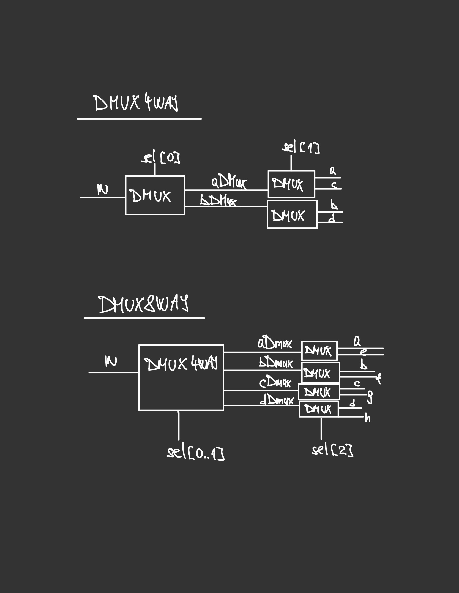
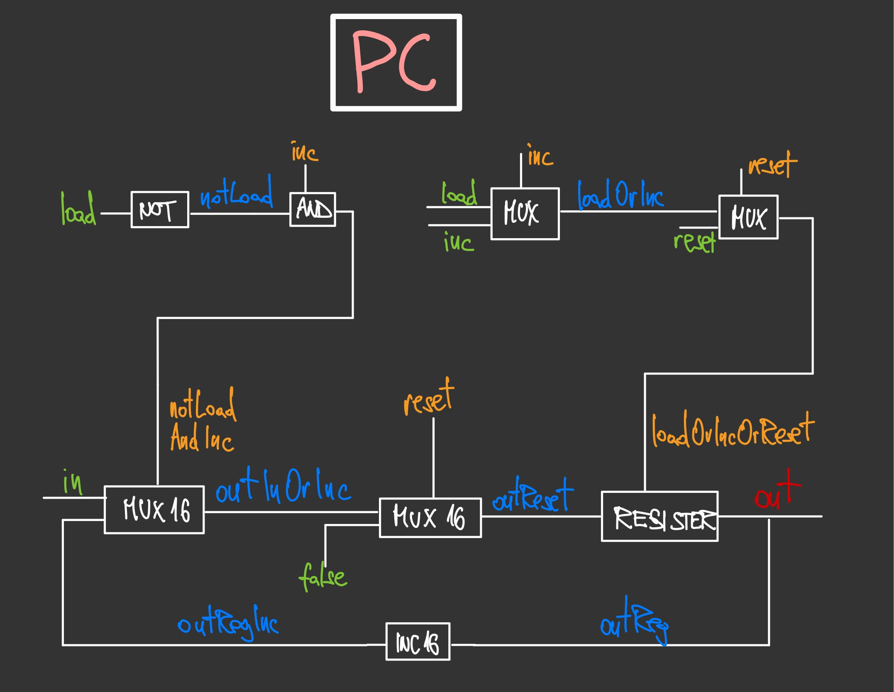

## Overview

In this [famous course](https://www.nand2tetris.org/) (often regarded as one of the best courses ever designed for Computer Science), we build a computer
from scratch, and then, using a higher-level programming language that we design ourselves, develop a program that runs on
that very computer.

This means that we go through all the building blocks a modern computer needs to be able to run software. In Part I we design
the hardware, and in Part II we focus on the software.

## Part I

Part I consists of five projects:

1. Boolean functions and gate logic
2. Boolean Arithmetic and the ALU (Arithmetic Logic Unit)
3. The main mermoy unit, RAM (random access memory)
4. Assembly programs in the Hack assembly language
5. The CPU (central processing unit), and the entire computer architecture
6. The assembler for the Hack assembly language

Feel free to check out my [repo for the course](https://github.com/aljazkovac/from-nand-to-tetris/tree/main/).

### Highlights and Notes on Project 1

I really enjoyed designing the chips using the HDL (Figure 1). One thing one needs to keep in mind is that the multi-bit buses are indexed from right to left, so the opposite from what one is used to. I especially enjoyed designing the Mux4Way16 and Mux8Way16 and the Dmux4Way and Dmux8Way chips. It helped to actually draw out the sketches for the designs to get a better understanding. Another interesting thing happened around this time. I saw a post by [Andrej Karpathy](https://github.com/karpathy) about [Cursor](https://www.cursor.com/), a fork of VS Code, but with a built-in AI assistant (basically similar to GitHub Copilot, the only difference being that Cursor offers the chance to choose between various models, such as ChatGPT4o, Claude Sonnet 3.5, etc.). It looked pretty good and I really enjoyed using it but it would automatically produce solutions for me for the first couple of chips. After a few minutes I realized I wasn't solving the problems myself, and was therefore not learning anything. I deleted all the solutions and re-implemented everything myself from scratch. This could lead to a further debate on how to properly use LLMs for both work and learning, but my general feeling at the moment is simply: Don't use them to give you solutions. Only use them as a form of quicker and more comprehensive research, or as a complement to Googling and reading the documentation. That is, if you actually want to learn anything, of course.

{: w="700" h="400" }
_Figure 1: Design for a Dmux4Way and a Dmux8Way chip_

### Highlights and Notes on Project 2

In this project we built an ALU (Arithmetic Logic Unit). We built a family of adders (half-adder, full adder, add16, inc16), and then we used those to build a full ALU. The ALU computes a function on two inputs, and outputs the result.
It can perform a family of 18 functions, including setting an integer to 0, negating it, addition, multiplication and division of two integers, etc. It is a simple and elegant design.

Here is my implementation in less than twenty lines of HDL code:

```verilog
 * ALU (Arithmetic Logic Unit):
 * Computes out = one of the following functions:
 *                0, 1, -1,
 *                x, y, !x, !y, -x, -y,
 *                x + 1, y + 1, x - 1, y - 1,
 *                x + y, x - y, y - x,
 *                x & y, x | y
 * on the 16-bit inputs x, y,
 * according to the input bits zx, nx, zy, ny, f, no.
 * In addition, computes the two output bits:
 * if (out == 0) zr = 1, else zr = 0
 * if (out < 0)  ng = 1, else ng = 0
 */
// Implementation: Manipulates the x and y inputs
// and operates on the resulting values, as follows:
// if (zx == 1) sets x = 0        // 16-bit constant
// if (nx == 1) sets x = !x       // bitwise not
// if (zy == 1) sets y = 0        // 16-bit constant
// if (ny == 1) sets y = !y       // bitwise not
// if (f == 1)  sets out = x + y  // integer 2's complement addition
// if (f == 0)  sets out = x & y  // bitwise and
// if (no == 1) sets out = !out   // bitwise not

CHIP ALU {
    IN
        x[16], y[16],  // 16-bit inputs
        zx, // zero the x input?
        nx, // negate the x input?
        zy, // zero the y input?
        ny, // negate the y input?
        f,  // compute (out = x + y) or (out = x & y)?
        no; // negate the out output?
    OUT
        out[16], // 16-bit output
        zr,      // if (out == 0) equals 1, else 0
        ng;      // if (out < 0)  equals 1, else 0

    PARTS:
    // Pre-setting the x-input
    Mux16(a=x, b[0..15]=false, sel=zx, out=xSetZero);
    Not16(in=xSetZero, out=notX);
    Mux16(a=xSetZero, b=notX, sel=nx, out=xSet);

    // Pre-setting the y-input
    Mux16(a=y, b[0..15]=false, sel=zy, out=ySetZero);
    Not16(in=ySetZero, out=notY);
    Mux16(a=ySetZero, b=notY, sel=ny, out=ySet);

    // Selecting between computing + or &
    Add16(a=xSet, b=ySet, out=xPlusY);
    And16(a=xSet, b=ySet, out=xAndY);
    Mux16(a=xAndY, b=xPlusY, sel=f, out=fSet);

    // Post-setting the output
    Not16(in=fSet, out=notOut);
    Mux16(a=fSet, b=notOut, sel=no, out=out, out[0..7]=outFirst, out[8..15]=outSecond, out[15]=outMSB);

    // Setting the control bits
    // Or8Way outputs 1 if any of the bits is 1, and 0 if all are 0
    Or8Way(in=outFirst, out=firstPartAllZero);
    Or8Way(in=outSecond, out=secondPartAllZero);
    Or(a=firstPartAllZero, b=secondPartAllZero, out=allBitsZero);
    Mux(a=true, b=false, sel=allBitsZero, out=zr);

    // if (MSB == 1) then the number is negative
    Mux(a=false, b=true, sel=outMSB, out=ng);
}
```

### Highlights and Notes on Project 3

In this part we built the computer's main memory unit, Random Access Memory, or RAM. This marks the point where we move from combinational logic to a clock-based sequential logic.

We know that the RAM is not the only type of memory in a computer. Other types are ROM (Read-only memory), which is persistent and stores the boot programs. Then we also have the cache memory (fast, small and expensive) and the disk memory (slow, large and inexpensive). The difference between RAM and cache is that cache is much faster and located closer to the CPU or even inside it, whereas RAM is located on the motherboard and is connected to the CPU via a memory bus. Cache is used for super fast access to data that is needed often, and RAM is used to access data and instructions that are being worked on by the system. The cache is checked first, then the RAM.

To be able to implement sequential logic, we need a gate that can "remember" the previous state. Such a gate is called a "flip-flop" gate, and in this course it was given to use. Otherwise, it can be implemented with Nand gates, by creating a "loop" and a "master-slave" setup. We used the given flip-flop gate, and other gates we built in project 1 and project 2, to build the following gates:

1. Bit
2. Register
3. RAM8
4. RAM64
5. RAM512
6. RAM4K
7. RAM16K
8. PS (Program counter)

I must admit that the program counter is the first thing in this course where I got really stuck. I could have used an LLM to help me, of course, or Googled around for tips and ideas, but I knew that the problem wasn't that hard, and I really wanted to give my brain a proper exercise. So I tried various ways of breaking the problem down into smaller pieces, drawing diagrams, turning the concepts around in my head. In the end, I did arrive at the correct solution, and one can see the elegance of it from the diagram below (Figure 2). You see, the logic of what input is chosen, follows the logic of what the selector bit will be in the register. This is what we do Computer Science for, the elegance of the solutions and the satisfaction of solving problems.

{: w="700" h="400" }
_Figure 2: Design for a Program Counter (PC)_

### Highlights and Notes on Project 4

This project was all about writing assembly programs using the Hack machine language, designed specifically for this course. I love writing low-level code, and find it intellectually much more interesting to high-level coding. The feeling of steering the computer at a very granular, basic level, gives a greater feeling of intelectual satisfaction, and reminds us of what computing is all about: zeroes and ones. It is important to note the difference between a machine language and an assembly language. The former is the zeroes and ones, the binary code that the CPU can execute. The assembly language is a level higher, a human-readable representation of machine language, which uses symbolic names (called mnemonics) instead of binary code. This makes it quite a bit easier to understand and write machine instructions. As such, there is a direct, one-to-one mapping between an assembly language and machine code, and the former is translated into the later by an assembler.

In this project, I wrote two simple assembly programs, one that blackens the screen if any key is pressed, and whitens it if the key is released; and one that multiples two numbers. Here is the first program:

```nasm
// This file is part of www.nand2tetris.org
// and the book "The Elements of Computing Systems"
// by Nisan and Schocken, MIT Press.
// File name: projects/4/Fill.asm

// Runs an infinite loop that listens to the keyboard input.
// When a key is pressed (any key), the program blackens the screen,
// i.e. writes "black" in every pixel. When no key is pressed,
// the screen should be cleared.

//// Replace this comment with your code.


// Set the start screen address
@SCREEN
D=A
@addr
M=D

// Set the end screen address
@SCREEN
D=A
@8192
D=D+A
@endscreenaddr
M=D

(MAINLOOP)
// Listen to keyboard input
@KBD
D=M

// Blacken screen if D-reg (keyboard input) does not contain 0.
@BLACK
D;JNE

@MAINLOOP
0;JMP

// Blacken screen
(BLACK)
@addr
A=M
M=-1

@KBD
D=M
@WHITE
D;JEQ

// Check if outside of screen
// highscreenaddr = 16384 (SCREEN) + 8192 = 24576
// if (addr - 24576 = 0) => egde of screen
@addr
D=M
@24576
D=D-A
@OUTSIDESCREENHIGH
D;JEQ

// Set new address
@addr
D=M
MD=D+1

@BLACK
0;JMP

// WHITE
(WHITE)
@addr
A=M
M=0

@KBD
D=M
@BLACK
D;JNE

// Check if outside of screen
// lowscreenaddr = 16384
// if (addr - 16384 = 0) => edge of screen
@addr
D=M
@SCREEN
D=D-A
@OUTSIDESCREENLOW
D;JEQ

// Set new address
@addr
D=M
MD=D-1

@WHITE
0;JMP

(OUTSIDESCREENHIGH)
@KBD
D=M
@WHITE
D;JEQ
@OUTSIDESCREENHIGH
0;JMP

(OUTSIDESCREENLOW)
@KBD
D=M
@BLACK
D;JNE
@OUTSIDESCREENLOW
0;JMP

// Unconditional jump to start of loop
@MAINLOOP
0;JMP
```

### Highlights and Notes on Project 5

In this part we had to finish and tie together the entire computer architecture. First we build the memory module, consisting of RAM, Screen and Keyboard parts. Then we design the central processing unit (CPU), which we connect to the memory and the ROM (the module that stores whatever program we decide to run.) Naturally, the most challenging part of this project was designing the CPU. The CPU essentially performs two main tasks:

1. Executes a given Hack instruction
2. Determines which instruction should be fetched and executed next.

In order to achieve that, it also needs to decode the instruction, determine what type of instruction it is (in our case, either an A or a C-instruction), and route the relevant bits to the relevant parts of the architecture.

As with Project 3, the most difficult part was coming up with the logic that controls the program counter. In this case, we had to come up with a logic gate architecture that realizes the following behavior: _*if jump then PC = A else PC++_*.

Here is my rather simplistic implementation:

```nasm
CHIP CPU {

    IN  inM[16],         // M value input  (M = contents of RAM[A])
        instruction[16], // Instruction for execution
        reset;           // Signals whether to re-start the current
                         // program (reset==1) or continue executing
                         // the current program (reset==0).

    OUT outM[16],        // M value output
        writeM,          // Write to M?
        addressM[15],    // Address in data memory (of M)
        pc[15];          // address of next instruction

    PARTS:

    Mux16(a=instruction, b=outALU, sel=instruction[15], out=AorCinstruction);
    Mux(a=true, b=instruction[5], sel=instruction[15], out=loadAreg); // Load the A-register if the instruction is an A-instruction
    ARegister(in=AorCinstruction, load=loadAreg, out[0..14]=addressM, out[0..15]=aregOut);
    And(a=instruction[15], b=instruction[4], out=loadDreg); // c3 == C-instruction and d2-bit set
    DRegister(in=outALU, load=loadDreg, out=dregOut);
    Mux16(a=aregOut, b=inM, sel=instruction[12], out=aregOutOrInM); // Send either A-register or inM as input to the ALU

    DMux8Way(in=true, sel=instruction[0..2], a=noJump, b=second, c=third, d=fourth, e=fifth, f=sixth, g=seventh, h=eight);

    Not(in=noJump, out=noJumpFalse);
    Not(in=zeroOut, out=notZero);
    Not(in=negOut, out=notNegative);
    And(a=notZero, b=notNegative, out=outGreaterThanZero);
    And(a=second, b=outGreaterThanZero, out=jumpIfGreaterThanZero);

    And(a=third, b=zeroOut, out=jumpIfZero);

    Or(a=zeroOut, b=notNegative, out=outGreaterThanOrZero);
    And(a=fourth, b=outGreaterThanOrZero, out=jumpIfGreaterThanOrZero);

    And(a=fifth, b=negOut, out=jumpIfLessThanZero);

    And(a=sixth, b=notZero, out=jumpIfNotZero);

    Or(a=negOut, b=zeroOut, out=outLessThanOrZero);
    And(a=seventh, b=outLessThanOrZero, out=jumpIfLessThanOrZero);

    Or(a=jumpIfGreaterThanZero, b=jumpIfZero, out=firstOr);
    Or(a=firstOr, b=jumpIfGreaterThanOrZero, out=secondOr);
    Or(a=secondOr, b=jumpIfLessThanZero, out=thirdOr);
    Or(a=thirdOr, b=jumpIfNotZero, out=fourthOr);
    Or(a=fourthOr, b=jumpIfLessThanOrZero, out=fifthOr);
    Or(a=fifthOr, b=eight, out=jumpConditions);

    And(a=noJumpFalse, b=jumpConditions, out=effectJump);
    And(a=effectJump, b=instruction[15], out=effectJumpIfCInstruction);

    And(a=instruction[15], b=instruction[3], out=writeM); // Write to memory if d3 set and instruction is a C-instruction

    PC(in=aregOut, load=effectJumpIfCInstruction, inc=true, reset=reset, out[0..14]=pc);
    ALU(x=dregOut, y=aregOutOrInM, zx=instruction[11], nx=instruction[10], zy=instruction[9], ny=instruction[8], f=instruction[7], no=instruction[6], out=outM, out[0..15]=outALU, zr=zeroOut, ng=negOut);
}
```

The rest was quite simple, and the final Hack computer implementation can then be done in only a few lines of HDL code. Feel free to check out [this part of my course repository](https://github.com/aljazkovac/from-nand-to-tetris/tree/main/part1/project5) for more detail.
