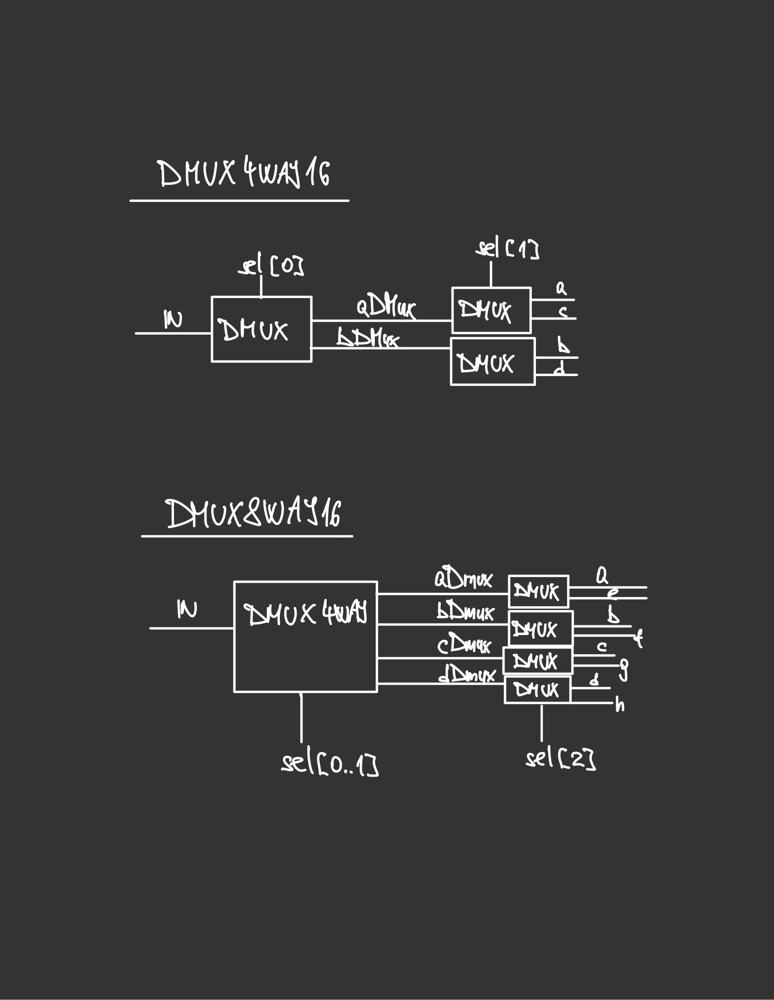

## Overview

In this famous course (often regarded as one of the best courses ever designed for Computer Science), we build a computer
from scratch, and then, using a higher-level programming language that we design ourselves, develop a program that runs on
that very computer.

This means that we go through all the building blocks a modern computer needs to be able to run software. In Part I we design
the hardware, and in Part II we focus on the software.

Part I consists of five projects:

1. Boolean functions and gate logic: we design our own basic chips, using the course's HDL (Hardware Descriptive Language), e.g.
   And, Not, Or, Xor, Mux, Dmux, etc.
2. Boolean Arithmetic and the ALU (Arithmetic Logic Unit)
3. etc.

Feel free to check out my [repo for the course](https://github.com/aljazkovac/from-nand-to-tetris/tree/main/).

## Highlights and Notes on Project 1

I really enjoyed designing the chips using the HDL (Figure 1). One thing one needs to keep in mind is that the multi-bit buses are indexed from right to left, so the opposite from what one is used to. I especially enjoyed designing the Mux4Way16 and Mux8Way16 and the Dmux4Way and Dmux8Way chips. It helped to actually draw out the sketches for the designs to get a better understanding. Another interesting thing happened around this time. I saw a post by [Andrej Karpathy](https://github.com/karpathy) about [Cursor](https://www.cursor.com/), a fork of VS Code, but with a built-in AI assistant (basically similar to GitHub Copilot, the only difference being that Cursor offers the chance to choose between various models, such as ChatGPT4o, Claude Sonnet 3.5, etc.). It looked pretty good and I really enjoyed using it but it would automatically produce solutions for me for the first couple of chips. After a few minutes I realized I wasn't solving the problems myself, and was therefore not learning anything. I deleted all the solutions and re-implemented everything myself from scratch. This could lead to a further debate on how to properly use LLMs for both work and learning, but my general feeling at the moment is simply: Don't use them to give you solutions. Only use them as a form of quicker and more comprehensive research, or as a complement to Googling and reading the documentation. That is, if you actually want to learn anything, of course.

{: w="700" h="400" }
_Figure 1: Design for a Dmux4Way16 and a Dmux8Way16 chip_
