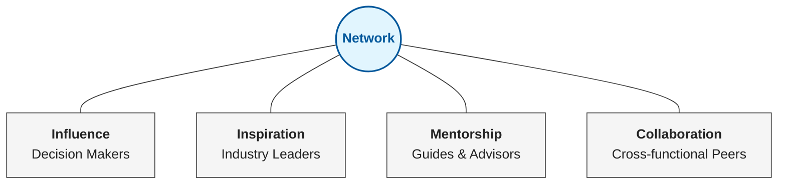
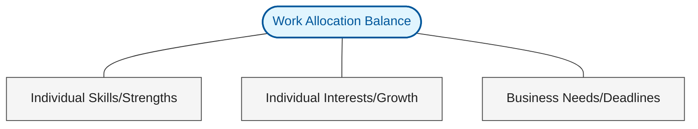
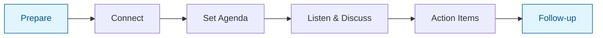
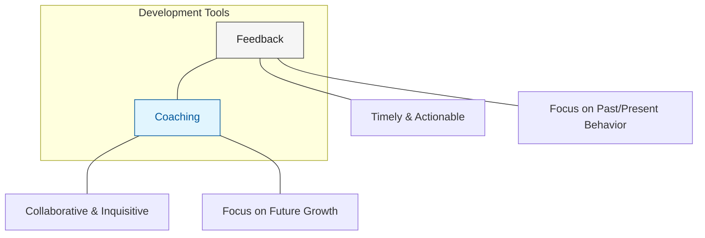
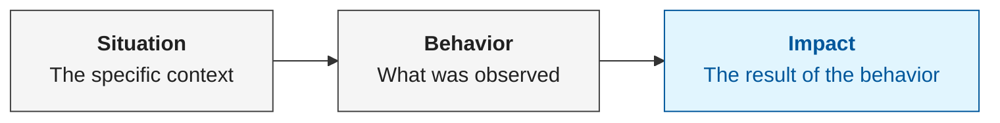
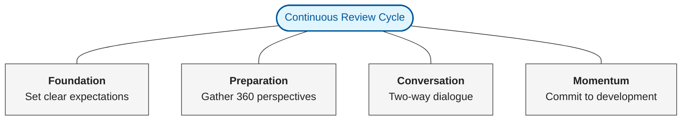
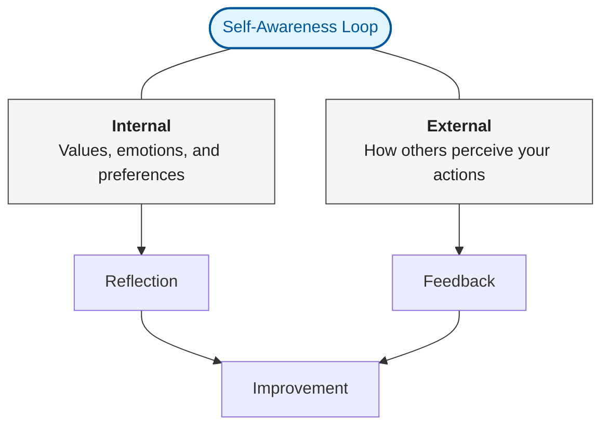
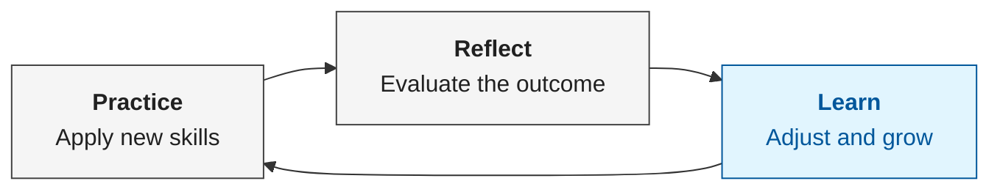

## Create a High-Performing Team

The shift from being an individual contributor to a manager is more than a change in title—it's a fundamental shift in how you deliver value. At Google, this is defined by three core pillars.

### The Google Manager Framework

The most effective managers don't just "manage"; they build communities and develop the next generation of leaders while delivering results.

### The Manager Mindset: Three Critical Shifts

Success as a manager requires moving away from the "doer" mentality. It’s no longer about your output, but the team's outcomes.

| From: Individual Contributor | To: People Manager                                     |
| :--------------------------- | :----------------------------------------------------- |
| **Execution Focus**          | **Enabling Focus** (Delegating to create growth)       |
| **Personal Career**          | **Team Progression** (Aligning work with their "why")  |
| **Tactical Decisions**       | **Systemic Impact** (Thinking in second-order effects) |

> **Self-Reflection Checkpoint:**
>
> - What tasks am I holding on to that could be growth opportunities for others?
> - Whose potential have I not fully unlocked?
> - In my next decision, how will this ripple across the whole team?

### Creating an Effective Team Culture

Culture isn't what you say; it's how you interact. High-performing teams are built on trust, open communication, and a shift from a "blame" culture to a "learning" culture.

#### Change Your Conversations

| Scenario             | Old Approach (Status Update)                | New Approach (Dialogue)                                       |
| :------------------- | :------------------------------------------ | :------------------------------------------------------------ |
| **1:1 Meetings**     | "Give me a list of what you did this week." | "What's the biggest challenge you faced, and how can I help?" |
| **Team Meetings**    | Settling for silence or one-way updates.    | Proactively inviting dissenting opinions and quiet voices.    |
| **Project Failures** | Identifying who made the mistake.           | Identifying what the system lacked that allowed the mistake.  |

### Practical Application: Navigating "Difficult" Dynamics

In one exercise, I explored how to handle technically capable but interpersonal "difficult" colleagues.

| Aspect        | Description                                                                                                                                                                                  |
| :------------ | :------------------------------------------------------------------------------------------------------------------------------------------------------------------------------------------- |
| **Scenario**  | Technically strong but unpleasant team member.                                                                                                                                               |
| **Goal**      | Improve culture without sacrificing technical excellence.                                                                                                                                    |
| **Approach**  | [**Radical Candor**](https://www.radicalcandor.com/frequently-asked-questions) (Kim Scott): Challenging directly while caring personally.                                                    |
| **Rationale** | Addressing behavior decisively avoids "toxic high-performers" from eroding team trust. Honesty about impact, paired with respect for their skill, is the only way to pivot the relationship. |

### Managing Beyond the Team: The Strategic Network

A manager’s effectiveness is often determined by their network outside their immediate team.

**How to build these connections:**

1. **Identify:** Who leads the teams we work with? Who is doing work I admire? Who makes the decisions that impact us?
2. **Reach Out:** Offer specific help, share relevant info, or simply show curiosity about their challenges.
3. **Consistency:** Don't just network when you need something. Be a consistent resource for others.

### Course certificate - Create a High-Performing Team

_Certificate for completing the Create a High-Performing Team course_

Validate the certificate at the [validation link](https://coursera.org/verify/NPI6WPHPZIOM).

## Set and Achieve Team Goals

Setting goals is more than a planning exercise; it's about creating a clear line of sight between individual tasks and the organization’s mission.

### Driving Results through Clarity and Meaning

To drive high performance, a manager must balance three critical ingredients:

| Ingredient  | Definition                                  | Manager's Role                                            |
| :---------- | :------------------------------------------ | :-------------------------------------------------------- |
| **Clarity** | Everyone knows their role and expectations. | Continuous, two-way conversation to remove ambiguity.     |
| **Meaning** | A personal "why" behind the work.           | Understanding individual motivators for each team member. |
| **Impact**  | Seeing the tangible results of the work.    | Providing proof that their contribution matters.          |

#### The SMART Framework

When translating vision into reality, goals should be structured using the SMART approach:

| Letter | Attribute      | Description                                  |
| :----- | :------------- | :------------------------------------------- |
| **S**  | **Specific**   | Clear and well-defined.                      |
| **M**  | **Measurable** | Tracks progress with concrete criteria.      |
| **A**  | **Attainable** | Realistic and achievable.                    |
| **R**  | **Relevant**   | Aligned with broader team and company goals. |
| **T**  | **Time-bound** | Has a defined start and end date.            |

### Designing Opportunities: The Three-Legged Stool

Great managers don't just assign work; they design opportunities. Effective work allocation requires balancing three competing needs:

**Key Reflection:** Where can you give someone a "stretch" assignment that balances their growth with the project's success?

### Supporting the Team through Effective Check-ins

Supporting a team is an active, ongoing process. The focus of check-ins should shift from "status updates" to "coaching and alignment."

#### The Check-in Lifecycle

**How to lead a high-impact check-in:**

1. **Prepare:** Use a shared document for goals and notes.
2. **Listen Actively:** Use open-ended questions like "What will be most challenging for you?"
3. **Support:** Ask "How can I help you be successful?" rather than just asking for progress.
4. **Alignment:** Ensure you both leave the conversation with the same understanding of the next steps.

### Course certificate - Set and Achieve Team Goals

_Certificate for completing the Set and Achieve Team Goals course_

Validate the certificate at the [validation link](https://coursera.org/verify/WK0LZX6D5ERK).

## Support Individual Growth and Development

Developing your team is a continuous cycle of coaching and feedback. The goal is to move beyond mere supervision to becoming a true partner in each team member's professional journey.

### Coaching vs. Feedback

While often used interchangeably, coaching and feedback serve distinct purposes in professional development.

### The Coaching Toolkit

Effective coaching is less about having all the answers and more about asking the right questions.

- **Listen Actively:** Give your full attention. Close the laptop. Put the phone away.
- **Embrace Silence:** Wait a few seconds before speaking. Give the other person space to think.
- **Reflect Back:** Use phrases like "This is what I'm hearing... do I have that right?"
- **Open-Ended Questions:** Avoid "Why" (which can feel accusatory). Instead, use:
  - "Tell me more about..."
  - "What do you think is the best next step?"
  - "What support do you need from me?"

### Providing Structured Feedback: The SBI Model

To make feedback effective, it must be objective and tied to specific outcomes. The SBI model ensures your feedback is clear and removes the risk of personal bias.

### The Performance Review Cycle

Performance reviews should contain no surprises. They are the natural conclusion to a cycle of continuous feedback.

### Handling Difficult Conversations

Difficult conversations are a tool for building trust. Approach them with empathy and a focus on solutions.

| Phase      | Key Actions                                                  |
| :--------- | :----------------------------------------------------------- |
| **Before** | Clarify your goals and adopt an empathetic mindset.          |
| **During** | Use the SBI model. Ask open-ended questions. Focus on facts. |
| **After**  | Share written next steps and a clear timeline for follow-up. |

> **Pro-Tip:** Upward feedback is just as critical. Regularly ask your team: "How can I better support you?" or "What would improve my communication?"

### Course certificate - Support Individual Growth and Development

_Certificate for completing the Support Individual Growth and Development course_

Validate the certificate at the [validation link](https://coursera.org/verify/O4LC6M0UHLSG).

## Grow as a Manager

The final course focuses on the most important asset you have as a leader: yourself. Sustained success requires a commitment to self-awareness and intentional development.

### The Foundation of Growth: Self-Awareness

Self-awareness is a dual-track process. It requires understanding both your internal drivers and your external impact.

### Strategic Time Management

For a manager, time is a finite resource that must be allocated strategically. Effective time management isn't about doing more; it's about doing what matters most.

| Strategy              | Actionable Step                                                                       |
| :-------------------- | :------------------------------------------------------------------------------------ |
| **Time Audit**        | Log your activities for a week to identify high-priority work vs. "noise."            |
| **Time Blocking**     | Schedule dedicated chunks for deep work and 1:1s.                                     |
| **Singular Focus**    | Avoid multi-tasking; it decreases productivity by up to 40%.                          |
| **Weekly Reflection** | Spend 15 minutes every Friday reviewing what went well and where you spent your time. |

### Investing in Yourself: The Learning Cycle

Great managers are lifelong learners. They use a simple, iterative cycle to turn experience into expertise.

**Personal Development Reflection:**

- What is one management skill I have successfully improved in the last quarter?
- Which skill, if improved, would add the most value to the team right now?
- What learning opportunity (workshop, book, peer-coaching) will I commit to next?

### Course certificate - Grow as a Manager

_Certificate for completing the Grow as a Manager course_

Validate the certificate at the [validation link](https://www.coursera.org/account/accomplishments/verify/QUDBIDTTHKVJ).

## Specialization Certificate and Closing Thoughts

That's all four courses—and the specialization—done! I was pleasantly surprised by this material. I'll admit I expected it to be somewhat fluffy or a collection of "influencer" quotes, but it was the opposite. It offers a wealth of practical, concrete approaches to people management that I can apply immediately in my day-to-day leadership.

If anything, the specialization has been a lesson in self-awareness: it highlighted how much I still have to learn, despite my background in teaching (which is essentially people management on steroids). I’m looking forward to putting these frameworks into practice.

_Certificate for completing the Google People Management Essentials Specialization_

Validate the certificate at the [validation link](https://www.coursera.org/account/accomplishments/specialization/XFX6N27RYFM2).
