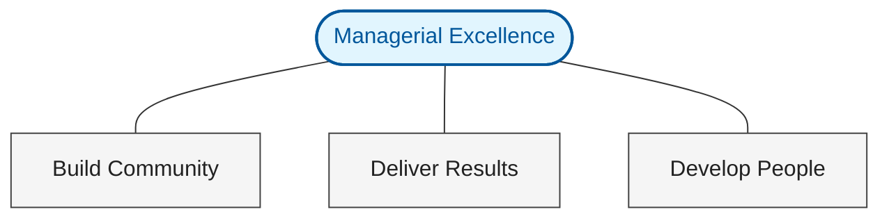

## Create a High-Performing Team

The shift from being an individual contributor to a manager is more than a change in title—it's a fundamental shift in how you deliver value. At Google, this is defined by three core pillars.

### The Google Manager Framework

The most effective managers don't just "manage"; they build communities and develop the next generation of leaders while delivering results.

### The Manager Mindset: Three Critical Shifts

Success as a manager requires moving away from the "doer" mentality. It’s no longer about your output, but the team's outcomes.

| From: Individual Contributor | To: People Manager                                     |
| :--------------------------- | :----------------------------------------------------- |
| **Execution Focus**          | **Enabling Focus** (Delegating to create growth)       |
| **Personal Career**          | **Team Progression** (Aligning work with their "why")  |
| **Tactical Decisions**       | **Systemic Impact** (Thinking in second-order effects) |

> **Self-Reflection Checkpoint:**
>
> - What tasks am I holding on to that could be growth opportunities for others?
> - Whose potential have I not fully unlocked?
> - In my next decision, how will this ripple across the whole team?

### Creating an Effective Team Culture

Culture isn't what you say; it's how you interact. High-performing teams are built on trust, open communication, and a shift from a "blame" culture to a "learning" culture.

#### Change Your Conversations

| Scenario             | Old Approach (Status Update)                | New Approach (Dialogue)                                       |
| :------------------- | :------------------------------------------ | :------------------------------------------------------------ |
| **1:1 Meetings**     | "Give me a list of what you did this week." | "What's the biggest challenge you faced, and how can I help?" |
| **Team Meetings**    | Settling for silence or one-way updates.    | Proactively inviting dissenting opinions and quiet voices.    |
| **Project Failures** | Identifying who made the mistake.           | Identifying what the system lacked that allowed the mistake.  |

### Practical Application: Navigating "Difficult" Dynamics

In one exercise, I explored how to handle technically capable but interpersonal "difficult" colleagues.

| Aspect        | Description                                                                                                                                                                                  |
| :------------ | :------------------------------------------------------------------------------------------------------------------------------------------------------------------------------------------- |
| **Scenario**  | Technically strong but unpleasant team member.                                                                                                                                               |
| **Goal**      | Improve culture without sacrificing technical excellence.                                                                                                                                    |
| **Approach**  | [**Radical Candor**](https://www.radicalcandor.com/frequently-asked-questions) (Kim Scott): Challenging directly while caring personally.                                                    |
| **Rationale** | Addressing behavior decisively avoids "toxic high-performers" from eroding team trust. Honesty about impact, paired with respect for their skill, is the only way to pivot the relationship. |

### Managing Beyond the Team: The Strategic Network

A manager’s effectiveness is often determined by their network outside their immediate team.

**How to build these connections:**

1.  **Identify:** Who leads the teams we work with? Who is doing work I admire? Who makes the decisions that impact us?
2.  **Reach Out:** Offer specific help, share relevant info, or simply show curiosity about their challenges.
3.  **Consistency:** Don't just network when you need something. Be a consistent resource for others.

### Create a High-Performing Team course certificate

_Certificate for completing the Create a High-Performing Team course_

Validate the certificate at the [validation link](https://coursera.org/verify/NPI6WPHPZIOM).

## Set and Achieve Team Goals

The main learnings of this course:

- Clear and compelling team roadmapping
- Effective work allocation
- How to combine high performance with genuine care and support goals for the team
- How to transform your approach to management

### Develop goals for the team

It is important that an individual on a team can see the connection of their work to the broader organizational goals. Achieve this through ongoing and constant communication. Set goals and define what success looks like. Be the wind in people's back. You will not be able to hit all your goals: When you don't win, you learn.

Key ingredients to help teams drive results:

- Clarity == everyone on the team can confidently explain what their role is and what the expectations on them are (requires consistent effort and two-way conversation)
- Meaning == your personal sense why you do this work. As a manager, you need to understand what motivates each team member.
- Impact == seeing the results of your work is proof that your work has an impact and motivates you.

How to set clear team goals:

- Get clarity on the organization's priorities and challenges
- Connect with the team on how to move the organization forward
- Break down team goals into clear individual goals

[SMART GOALS](https://www.atlassian.com/blog/productivity/how-to-write-smart-goals): An approach that helps translate vision into reality when it comes to great goal-building.

- S: Specific
- M: Measurable
- A: Attainable
- R: Relevant
- T: Time-bound

Important: Periodically reevaluate if the goal still makes sense and can be achieved.

With these goals you are setting your team up for success because they know WHAT they are aiming for and WHY it matters.

Activity: Practice goal setting. Consider including something from the finished template: <https://docs.google.com/document/d/1fh5CDsOb8l8cnkkUR95jCDGXlXfMCs8X-pBZx3tT8fI/edit?tab=t.0>

Never set goals in a vacuum! Discuss them with your management and your team and collaborate to come up with a final version that everyone can collaborate on and feel proud to be doing.

### Allocate work effectively

Thoughtfully connect the right person to the right goal when allocating work.
Consider:

- Their skills
- Their interests
- Their current workload

Ask yourself: where can I give someone a chance to grow and shine?

When you talk to your team, go beyond status reports. Ask questions such as:

- What part of this goal are you most excited about?
- Where do you see the biggest opportunity?
- What will be most challenging for you?
- What new methods might you explore to reach the goal?

Both sides of equation: people and the needs of the business. A three-legged stool: the current state of the individual; the interest or goals of the individual; the need of the business.

The key to assigning work well is to look for opportunities in every task. Every project is a chance to build skills, engagement, and impact for team members. Great managers don't assign work, they design opportunities! It is important to balance "stretching" an employee with "utilizing their existing strengths" to ensure the project doesn't fail.

### Support the team in achieving goals

1. Know what everyone is working on and how they're doing: shared document, regular meetings, good project tracking.
2. Support team member by asking: How can I help you be successful? How is your work going? What's in your way? **Listen actively and be understanding!** => Feeling heard can make a huge difference!
3. Provide tangible support: training, connection with colleagues, help explore different points of view. Connect the team to the right resources and people.
4. Supporting the team is an active, ongoing process.

**How to lead an effective check-in:**

- Prepare for the check-in: Create a dedicated, shared document for each team member to capture their goals, check-in notes, and career interests.
- Start with a friendly connection
- Create the agenda together
- Use active listening
- Discuss performance
- Encourage decision-making
- Establish career checkpoints
- Provide clear takeaways and ensure alignment

### Set and Achieve Team Goals course certificate

_Certificate for completing the Set and Achieve Team Goals course_

Validate the certificate at the [validation link](https://coursera.org/verify/WK0LZX6D5ERK).

## Support Individual Growth and Development

Focus on:

- What it means to be a good coach
- How to give effective feedback
- How to conduct meaningful performance reviews
- How to navigate tough conversation
- How to ask for and receive feedback

### Develop and coach the team

**The relationship between a manager and a report is very similar to the relationship between a coach and an athlete.**

The approach to developing a report:

- Identify the skill gap for the next level
- Work collaboratively to create a plan to close that gap
- Give coaching and feedback until they achieve that next level

Two of the most important factors in growth and development:

- Feedback: information you can provide to a report that is actionable by them and that helps them perform better
- Coaching: the act of collaborating with your report to give them guidance and help them grow

**Management is a learnable skill.**

The single most important thing good managers do is give good coaching and feedback.

Ask your team: What kind of coaching or feedback would you like from me?

Instead of providing answers, challenge team members to think through a challenge and come up with their own solutions. Ask open-ended questions, avoid leading questions. "Tell me more" works really well. Also, give the team member your full attention: put the phone down and close your laptop. Get comfortable with silence as well. Wait a few seconds before speaking. Also, repeat back information to confirm that you understand correctly (reflecting back or looping).

Reflecting back:

- This is what I'm hearing
- Do I have this right?
- What do you think would be the best next step?

Encourage questions and ask open-ended questions, instead of giving advice or helping out with a solution immediately. Give the person you're talking to your full attention. Be grounded, and be fully present.

Practice coaching and feedback with [Portraits](https://portraits.google.com/gallery), AI assistant coaches.

### Provide feedback to team members

Feedback is one of the most important things a manager can give a team to support growth and development.

Qualities of effective feedback:

- Actionable
- Timely
- Specific

To share feedback in a structured way, use the [Situation - Behaviour - Impact (SBI) Model](https://www.ccl.org/articles/leading-effectively-articles/closing-the-gap-between-intent-vs-impact-sbii/):

- You capture the situation
- Describe the behaviours that occured
- Describe the impact that the behaviours had

After sharing your feedback, pause and listen. Give the team member to share their thoughts and feelings. This builds trust.

**Feedback is not just for negative behaviours. Reinforce good behaviours by giving positive feedback, or sharing positive recognition with other managers and leaders.**

**How to give feedback with a coaching approach**:

1. **Start with a reflection**: Give the team member time to process the feedback. Encourage them to reflect and ask clarifying questions about the specific behaviors and their impact. You could ask, "What are your initial thoughts on the feedback I've shared?" or, "Is there anything I can clarify?"
2. **Identify areas for action**: Work together to pinpoint the specific areas for improvement. Ask open-ended questions like, "What steps could you take to enhance this skill?" or "What adjustments could we explore for this project?"
3. **Co-create a plan**: Encourage the team member to develop an action plan with specific steps and deadlines. Support their ownership by asking, "What do you think is the best way to move forward from here?"
4. **Offer support**: Guide the team member towards available resources - like mentors, colleagues, or training material - and facilitate connections if needed.
5. **Follow up**: Regularly check-in on progress, offer support, and celebrate successes along the way.

When you ask open-ended questions, avoid starting with "Why ...". This can make the report defensive.

**Navigating disagreement**:

- **Listen with empathy**: Acknowledge and validate their feelings without becoming defensive. Use phrases like, "I understand why you might feel that way," or "It's completely valid to feel..."
- **Reiterate your intent**: Remind them that the feedback is meant to support them. You could say, "I’m sharing this because I believe in your potential and want to help you succeed."
- **Focus on facts and impact**: Use specific, evidence-based examples, and explain the impact of the behavior, following the SBI™ Model.
- **Collaborate on a solution**: Make them a partner in finding the solution. Ask, "What solutions have you considered?" or "What ideas do you have for moving forward?"

### Measure and evaluate team member performance

Performance reviews create a structured opportunity to pause and reflect. It does not replace 1:1s, coaching and feedback. Use ongoing conversations to give ongoing feedback. Do not raise new issues from months ago in a performance review.

Performance review:

- Reflect on the year
- Ask questions: How do you feel you've grown since last year? What are you most proud of?
- Discuss growth opportunities
- Consider the future: set goals to take action on feedback, find ways to expand responsibilities, etc.

Provide a copy of the performance review in writing.

**Performance review template:**

**Step 1: Beginning of the cycle: Lay the foundation**
Successful reviews contain no surprises. They are the natural conclusion to a cycle that starts with clear expectations and is supported by your continuous coaching and feedback prior to the review.

- Set expectations and goals: Collaborate with each team member at the start of the cycle to set clear goals and define what success looks like in their role.
- Track progress on goals: Check in frequently to discuss progress toward goals and handle any challenges that arise.
- Give coaching and feedback along the way: Coaching and feedback are most effective when they are timely, so address issues and celebrate wins as they happen.

**Step 2: Before the review: Thoughtful preparation**
Your preparation is key to a productive review. Take time to get the full picture of your team member’s performance.

- Get perspectives beyond your own: Who has the team member been working with? Gather feedback from peers, other departments, or even clients to deliver a well-rounded review. Insight into how the team member works, collaborates with others, and achieves goals will help guide your feedback.
- Ensure feedback is relevant. Is the feedback you plan to deliver directly aligned with the team member’s job responsibilities and goals? If not, consider leaving it out.
- Challenge your own assumptions. Before delivering feedback, take a moment to check your perspective. Are you letting a recent project overshadow a year's work? Are you applying the same rating scale consistently to everyone?
- Explain the process: Be transparent with your team members about how the review process works. This will help them prepare to discuss their performance, challenges, and opportunities, so they can actively contribute to the conversation.

**Step 3: During the review: A two-way conversation**
The review meeting is more than just a look back; it's a launchpad for the future. Let’s look at how to transform a simple performance summary into a productive, two-way conversation that builds a collaborative plan for what's next.

- Encourage a two-way dialogue: Spark a conversation by asking open-ended questions like, "What achievement are you most proud of from this cycle?" Then, truly listen. Pausing allows the team member to respond to feedback and share their own insights, which might give you a new perspective to consider.
- Ground your feedback in facts: Use specific, evidence-based examples to support your assessments. This isn't just about identifying what needs to change; it's also about reinforcing what they should continue doing. This gives the team member a broader understanding of how to achieve high performance.
- Offer growth opportunities: Think of performance reviews as a chance to look forward. Talk with team members about how they'd like to grow. Help them find a mentor, take on a visible, high-impact project, or learn a new skill. To do this fairly, be sure you invest in the future of each team member. It's a great way to help them reach their full potential.
- Summarize and confirm next steps: Leave the meeting with clarity and alignment. Summarize the key takeaways and confirm the action plan you've built together. Simple questions like, “What support do you need from me to be successful?”, and "What questions do you have about our plan?" ensures you both leave the conversation on the same page, ready for the months ahead.

**Step 4: After the review: Continuing the momentum**
The review conversation doesn't end when the meeting is over. By revisiting the key topics after the meeting, you can transform a single conversation into a cycle of continuous growth.

- Finalize and share documentation: Promptly complete and share any official review paperwork, clearly outlining the goals and development plans you discussed. This provides the team member with a tangible guide for the coming months and reinforces the path you created together.
- Continue the conversation: Use your regular check-ins as an opportunity to follow up on goals, discuss progress, and offer continuous support. This helps turn the review’s insights into everyday action.
- Commit to their development: Show you are invested by following through on the plans you've created to help every team member grow. Your commitment to their growth is a powerful way to help them unlock their full potential.

**Difficult conversations build trust.** Here are some techniques to approach them with confidence:

Before:

- Clarify your goals
- Adopt an empathetic mindset

During:

- Approach the issue with empathy
- Ask open-ended questions
- Review the agenda
- Deliver the feedback (use the SBI model!)

Adapt the conversation to the person and their experience.

After:

- Share written next steps and a timeline

Being a people manager is a great opportunity to have more influence in the organization, enable others to perform to their best ability, and to pay it forward.

Upward feedback (getting feedback from the team on your leadership):

- Ask for feedback regularly
- Ask open-ended questions: How can I better support you? What would improve my communication with the team?
- Thank your team for their honesty

**The best leaders are always learning and your team's perspectives are priceless for your growth!**

### Support Individual Growth and Development course certificate

_Certificate for completing the Support Individual Growth and Development course_

Validate the certificate at the [validation link](https://coursera.org/verify/O4LC6M0UHLSG).

## Grow as a Manager

Focus on how to build a foundation for sustained success and impact as a leader:

- Understand the importance of self-awareness and continual self-development in improving management practices.
- Apply time management strategies managers can use to maximize productivity.
- Utilize reflection and feedback to improve self-awareness.
- Develop a plan for investing in ongoing development as a manager.

Approach your role with a growth mindset. Keep your ego in check and stay balanced, so that you can continue to stay self-aware.

### Become a self-aware manager

Reflecting on your strengths and development areas is key!

Self-awaraness:

- internal: an understanding of your own strenghts, development areas, values, emotions, preferences, etc. => this improves your self-esteem and sense of purpose.
- external: developing an understanding of what others think about you.=> can help improve your interactions

Practicing self-awareness:

- write down observations on the incident
- seek feedback
- ask yourself what you can do to improve
- be aware of how you respond to feedback

### Invest in yourself as a manager

Effective time management is key to becoming a great manager. Effective time management can help you:

- manage stress
- focus on high-priority work
- maximize your productivity

Time management strategies:

- completing a time audit
- identifying important tasks
- creating short-term due dates
- using time blocking: scheduling your time into chunks that allow you to be most productive
- focusing on one task at a time (multi-tasking decreases productivity!)
- reflecting at the end of each week: what went well, what could have be improved, and where you spent time most effectively

Time management is something you need to consider every day and every week: it is a dynamic process. You want to stay flexible and communicate to your team how you are managing your own time.

Managers have a direct impact on the motivation levels of their reports, but they need to find the time for their own development too.
Use the following cycle: practice -> reflect -> learn.
Reflection:

- How have I tried to improve my management skills in the last three months?
- What is one management skill that I have succesfully improved?
- Which management skill can I improve to add the most value to the team I manage?

Get feedback from your direct reports, manager peers and your manager!

Learning opportunities:

- workshops
- courses
- books, articles
- podcasts
- learning from others
- learning by doing

An effective manager stays curious and is constantly learning!

### Grow as a Manager course certificate

_Certificate for completing the Grow as a Manager course_

Validate the certificate at the [validation link](https://www.coursera.org/account/accomplishments/verify/QUDBIDTTHKVJ).

## Google Management Essentials Specialization Certificate

_Certificate for completing the Google People Management Essentials Specialization_

Validate the certificate at the [validation link](https://www.coursera.org/account/accomplishments/specialization/XFX6N27RYFM2).

## LinkedIn Strategy

To promote this specialization effectively while respecting the "Jante Law" and the current confidentiality of upcoming role transitions, use the following approach:

### The "Continuous Learning" Angle

Frame the post around your current role as a Team Lead. This signals growth to your CTO (Rob) and EM (Alex) without making unofficial announcements.

**Draft Post Structure:**

- **Hook:** "Technical leadership in Platform Engineering is as much about people as it is about infrastructure."
- **Value:** Mention that you took this specialization to better support your team and refine your approach to coaching and feedback.
- **Key Takeaways:** Highlight the SBI model for feedback and the shift from "assigning work" to "designing opportunities."
- **CTA:** Link to this blog post as a resource for other technical leads.

Headline: Investing in the "Human side" of Platform Engineering.

Post Text:
Technical roadmaps and architecture are only half the battle in Platform Engineering. The other half—and often the more challenging part—is the people.

I recently completed the "Google People Management Essentials" Specialization on Coursera to better support my team and sharpen my approach to leadership.

A few key takeaways that I’m already applying:
🔹 The Manager Mindset: Shifting focus from personal output to team-wide impact.
🔹 The SBI Model: A structured approach to feedback (Situation - Behavior - Impact) that removes the "guesswork."
🔹 Design, Don't Just Assign: Thinking of tasks as growth opportunities rather than just tickets.

I’ve documented my full notes and reflections on my blog for any other leads or engineers looking to bridge the gap between technical and people leadership.

### Timeline

1. **Immediate:** Publish this blog post and share on LinkedIn focusing on the "Lead's Toolkit."
2. **Future (Late Q3):** Once the EM role is official and you have experience, write a "Theory vs. Reality" essay contrasting these Google frameworks with actual interim management challenges.

## Plan for Course 1 Improvement: Create a High-Performing Team

This plan outlines how to transform the raw notes for the first course into a more reader-friendly format while retaining the core learnings.

### 1. Visualizations

- **Google's Manager Framework:** A Mermaid Venn diagram showing the overlap between "Build Community," "Deliver Results," and "Develop People."
- **The Three Mindset Shifts:** A "From/To" comparison table to clearly contrast the Individual Contributor mindset versus the Manager mindset.
- **The Relationship Map:** A Mermaid 2x2 matrix to help readers categorize their professional network into Collaboration, Inspiration, Mentorship, and Influence.

### 2. Text Overview & Structure

- **Introduction:** Sharpen the core definition of management as a "builder of teams" rather than a "doer of tasks."
- **The Mindset Shift:** Convert the bullet points into a more structured "Internal Reflection" section with call-out boxes for the three critical questions.
- **Team Culture:** Use a "Change the Conversation" section with a clear table showing "Old Approach" vs. "New Approach" for 1:1s and meetings.
- **Practical Application:** Retain the scenario table but add a brief "Reflective Commentary" to explain why Radical Candor was the chosen approach.
- **Managing Up & Across:** Group the "How to reach out" and "How to build" ideas into a cohesive strategy for proactive networking.
