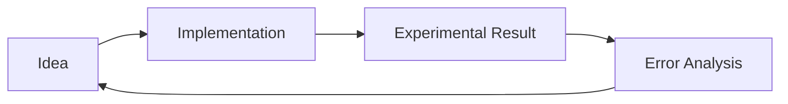

Large Language Models (LLMs) have transformed how we build software. Understanding how to interact with them effectively is now a core developer skill. Generally, we work with two types of models:

- **Base Models:** Trained to predict the next word based on vast amounts of data.
- **Instruction-Tuned LLMs:** Specifically trained to follow instructions, often refined using Reinforcement Learning with Human Feedback (RLHF).

## Core Prompting Principles

To get the most out of an LLM, follow these two fundamental principles.

### 1. Write Clear and Specific Instructions

Vague prompts lead to vague results. Be as descriptive as possible.

- **Use Delimiters:** Clearly indicate distinct parts of your input (e.g., using triple backticks, quotes, or XML tags) to help the model identify context.
- **Request Structured Output:** Ask for JSON or HTML to make it easier to parse the model's response programmatically.
- **Verify Conditions:** Instruct the model to first check if certain assumptions are met before proceeding with a task.
- **"Few-Shot" Prompting:** Provide successful examples of the task to set the expected pattern.

### 2. Give the Model Time to "Think"

If a task is complex, the model might rush to an incorrect conclusion.

- **Specify Steps:** Explicitly list the sequence of steps required to complete the task.
- **Self-Correction:** Ask the model to work out its own solution first before comparing it to a provided answer.

> **Warning:** Be mindful of **Hallucinations**. Models can generate statements that sound plausible but are factually incorrect. Always verify critical information.

## Iterative Prompt Development

Prompt engineering is an experimental process. It is rare for a prompt to be perfect on the first try.

## Advanced Capabilities

Beyond simple Q&A, LLMs excel at several higher-level tasks:

- **Summarizing:** Condense long articles with a specific focus (e.g., focus on shipping costs for a product review).
- **Inferring:** Perform sentiment analysis, emotion detection, or topic extraction from raw text.
- **Transforming:** Handle language translation, grammar checks, tone adjustments, and format conversions (e.g., JSON to HTML).
- **Expanding:** Generate personalized content, such as email responses, based on short snippets of information.

### A Note on Temperature

- **Low Temperature (e.g., 0):** Most predictable and reliable. Best for tasks requiring high accuracy.
- **High Temperature (e.g., 0.7+):** Increases variety and "creativity." Best for tasks requiring diverse or unique outputs.

## Course certificate - ChatGPT Prompt Engineering

_Certificate for completing the ChatGPT Prompt Engineering course_

Validate the certificate at the [validation link](https://learn.deeplearning.ai/accomplishments/ffe8a579-44c4-42cc-bf7a-e5984eb2017a).
