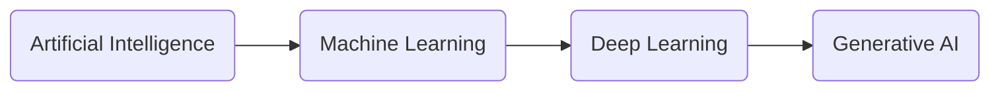
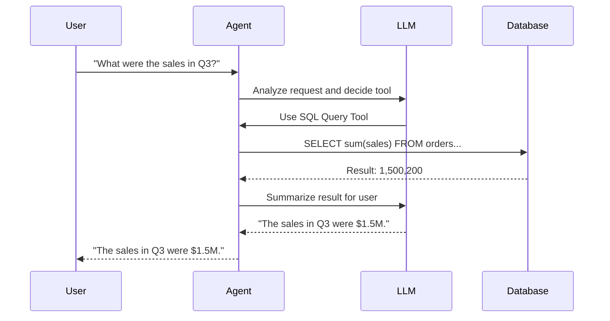

Building an AI agent to interact with tabular data and SQL databases represents a significant step in making data more accessible through natural language. Using the LangChain agents framework, we can bridge the gap between unstructured LLM responses and structured data.

## Key Learnings

- **LLM Deployment:** Setting up foundation models for agentic behavior.
- **RAG with Tabular Data:** Grounding model responses in specific datasets.
- **Database Agents:** Developing systems that can query and interpret SQL databases.
- **Function Calling:** Building reliable systems that bridge LLMs and external APIs.
- **Azure OpenAI Integration:** Leveraging the Assistants API.

## The Road to Generative AI

The progression toward generative AI shows how we've moved from rigid programming to flexible foundation models capable of multiple skills.

## How a Database Agent Works

A typical database agent workflow involves a loop where the LLM decides which tools (SQL queries, data analysis) to use based on a user's natural language request.

## Practical Implementation

### Interacting with CSV Data

LangChain's dataframe agent provides a high-level interface for interacting with CSV data directly, enabling natural language analysis of spreadsheet-style information.

### Connecting to SQL Databases

The transition to SQL requires more robust mechanisms. Azure OpenAI's Function Calling feature is critical here, ensuring the LLM outputs structured query parameters rather than unpredictable text.

### The Evolution of APIs

While the Assistants API was a major step, it's worth noting the shift toward the [Responses API](https://developers.openai.com/api/reference/responses/overview) for generating more consistent model responses in production environments.

## Course Certificate

_Certificate for completing the Building Your Own Database Agent course_

You can validate the certificate at the [validation link](https://learn.deeplearning.ai/accomplishments/38f7afee-ee6f-4a49-bc08-fba2dea9361a).
