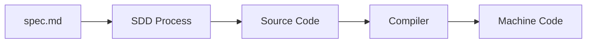
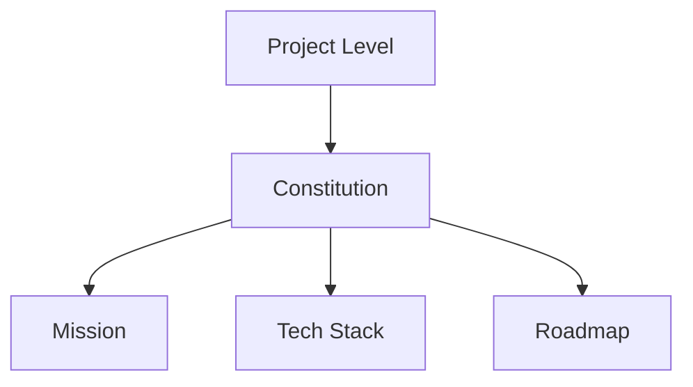

## Introduction

Spec-driven development (SDD) is a methodology that shifts the focus from manual coding to the creation and maintenance of a high-fidelity specification. When working with coding agents, this approach offers several key advantages:

- **Granular Control:** You can influence the final codebase through small, precise changes to the specification.
- **Context Preservation:** It eliminates "context decay" by providing a stable, centralized source of truth.
- **Intent Fidelity:** It ensures the agent's output aligns closely with your original requirements.

The fundamental flow of SDD can be visualized as follows:

## Workflow Overview

The SDD workflow operates across two main levels: the **Project Level** and the **Feature Level**.

### Project Level: The Constitution

At the project level, you define the "Constitution" of your application. This consists of three living documents that guide the agent's understanding:

1. **Mission:** The "Why." It defines the vision, target audience, and overall scope.
2. **Tech Stack:** The "How." A common understanding of the technologies used for development and deployment.
3. **Roadmap:** The "When." A sequence of phases and features to be implemented.

The agent uses these to handle low-level implementation details while you focus on the high-level goals and constraints.

### Feature Level: Implementation Phase

Once the project framework is set, individual features move through a repeatable cycle:

**Specification → Implementation → Validation**

This phase relies on three key documents: `plan.md`, `requirements.md`, and `validation.md`. The roles are clearly defined:

- **Developer:** Acts as the supervisor, designing the plan, reviewing output, and either accepting changes or requesting iterations.
- **Builders/Agents:** Execute the plan by writing the actual code.

## Tips and Tricks

To maximize the efficiency of coding agents in an SDD workflow, consider these tools and techniques:

- **Interactive Feedback:** Use the `AskUserQuestion` tool to resolve ambiguities early.
- **Real-Time Documentation:** Leverage [Context7](https://context7.com/) to provide the LLM with the most up-to-date documentation and library references.
- **Frameworks:** Explore established patterns like [Spec Kit](https://github.com/github/spec-kit) or [Open Spec](https://github.com/Fission-AI/OpenSpec).

## Conclusion

Spec-driven development is currently one of the industry's favorite buzzwords, touted as the next big thing for agentic coding. However, as I progressed through the course, I realized that SDD isn't necessarily a revolutionary new paradigm—it's essentially a formalization of what many of us have been doing for a long time: working in a structured, organized way.

I found that I was already practicing the core principles of SDD, just with different labels. I used a `TODO.md` instead of a `ROADMAP.md`, `AGENTS.md` instead of `MISSION.md`, and `README.md` instead of `TECH-STACK.md`. The specific names don't matter as much as the underlying discipline of using an organized set of files to plan, control, and validate work.

The real takeaway isn't that you must adopt the SDD framework to be successful. Working with LLMs introduces significant cognitive debt and places a heavy demand on our context-switching capabilities. The goal shouldn't be to get bogged down in a specific framework, but to find your own structured way of dealing with that debt. Whether it's SDD or your own custom workflow, the best approach is the one that fits your preferences, your habits, and the specific needs of your project. Don't follow the buzz; follow the structure that actually works for you.

## Accomplishment

_Accomplishment - completing the course Spec-Driven Development_

Validate the accomplishment at the [validation link](https://learn.deeplearning.ai/accomplishments/effdff70-8dad-4a3a-8c55-9a66d50cd657).
