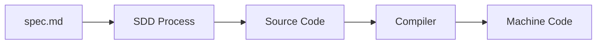
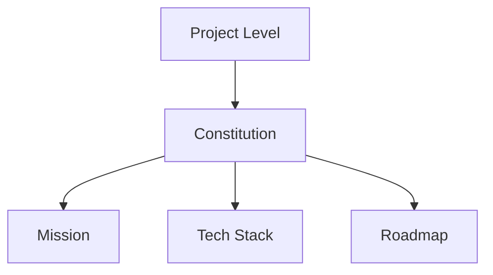

## Introduction

Spec-driven development (SDD) is a methodology that shifts the focus from manual coding to the creation and maintenance of a high-fidelity specification. When working with coding agents, this approach offers several key advantages:

- **Granular Control:** You can influence the final codebase through small, precise changes to the specification.
- **Context Preservation:** It eliminates "context decay" by providing a stable, centralized source of truth.
- **Intent Fidelity:** It ensures the agent's output aligns closely with your original requirements.

The fundamental flow of SDD can be visualized as follows:

## Workflow Overview

The SDD workflow operates across two main levels: the **Project Level** and the **Feature Level**.

### Project Level: The Constitution

At the project level, you define the "Constitution" of your application. This consists of three living documents that guide the agent's understanding:

1. **Mission:** The "Why." It defines the vision, target audience, and overall scope.
2. **Tech Stack:** The "How." A common understanding of the technologies used for development and deployment.
3. **Roadmap:** The "When." A sequence of phases and features to be implemented.

The agent uses these to handle low-level implementation details while you focus on the high-level goals and constraints.

### Feature Level: Implementation Phase

Once the project framework is set, individual features move through a repeatable cycle:

**Specification → Implementation → Validation**

This phase relies on three key documents: `plan.md`, `requirements.md`, and `validation.md`. The roles are clearly defined:

- **Developer:** Acts as the supervisor, designing the plan, reviewing output, and either accepting changes or requesting iterations.
- **Builders/Agents:** Execute the plan by writing the actual code.

## Tips and Tricks

To maximize the efficiency of coding agents in an SDD workflow, consider these tools and techniques:

- **Interactive Feedback:** Use the `AskUserQuestion` tool to resolve ambiguities early.
- **Real-Time Documentation:** Leverage [Context7](https://context7.com/) to provide the LLM with the most up-to-date documentation and library references.
- **Frameworks:** Explore established patterns like [Spec Kit](https://github.com/github/spec-kit) or [Open Spec](https://github.com/Fission-AI/OpenSpec).

## Conclusion

Spec-driven development is one of the latest buzz-words and it is supposed to be the next big thing when working with LLMs. I decided to take this course, expecting to learn an entirely new way of working with agentic coding. Very soon into the course I realized that I have been using my own version of "spec-driven development" for quite a while now. So, what is spec-driven development? It is just a way of working with an LLM in a structured way, using an organized set of .md files to plan, control and validate your work. It does not matter what the actual files are called and how the work is structured as long as it is organized well and your team understands and follows the same convention. I have been using a TODO.md file instead of a ROADMAP.md. AGENTS.md instead of MISSION.md. And README.md instead of TECH-STACK.md. It has worked quite well for me and I did not even realized I have been doing the new hot thing, "spec-driven development"!.

The point is: find your own structured way of working and do not let yourself be bogged down by a specific framework. Working with an LLM introduces a lot of cognitive debt and places great demand on our context-switching capabilities. Find your own way of dealing with this, depending on your ability, preferences and old habits, as well as the project you are working on.

## Accomplishment

_Accomplishment - completing the course Spec-Driven Development_

Validate the accomplishment at the [validation link](https://learn.deeplearning.ai/accomplishments/effdff70-8dad-4a3a-8c55-9a66d50cd657).
