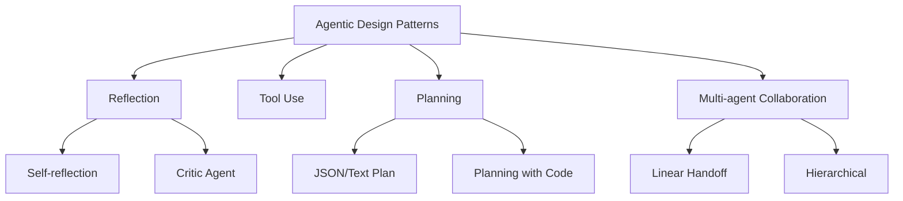
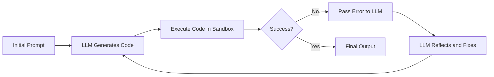

## Module 1: Introduction to Agentic Workflows

An agentic workflow follows an iterative cycle where thinking and research are followed by revision and further refinement. Unlike traditional linear prompts, an LLM-based application executes multiple steps autonomously to complete a complex task.

Agentic AI can range from low to high levels of autonomy depending on the design.

### Benefits of Agentic Workflows

- **Superior Performance:** Outperforms non-agentic workflows on complex reasoning tasks.
- **Parallelization:** Ability to run multiple sub-tasks concurrently.
- **Modularity:** Easy to add tools, update capabilities, or swap underlying models.

### Task Decomposition

Breaking a task down into smaller, manageable steps often yields better results than direct generation or one-shot prompting.

**Building Blocks:**

- **Models:** LLMs and specialized AI models.
- **Tools:** APIs, information retrieval (RAG), and code execution.

The goal is to decompose tasks until each step can be handled reliably by one of these building blocks.

### Evaluating Agentic AI (Evals)

Once a workflow is built, focus on the low-quality outputs to drive improvements.

- **Objective Evals:** Automated checks (e.g., code execution results, unit tests).
- **Subjective Evals:** Using an LLM as a judge to evaluate qualitative aspects.

Evaluation can happen at different scales:

- **End-to-End:** Testing the entire workflow.
- **Component-Level:** Testing individual steps or tools.

Examining intermediate traces is essential for effective error analysis.

### Agentic Design Patterns

There are four primary design patterns for building agentic workflows:

- **Reflection:** The agent critiques its own output or receives feedback from a critic agent.
- **Tool Use:** Leveraging external tools like web search or database queries.
- **Planning:** The agent determines the sequence of actions needed to reach a goal.
- **Multi-agent Collaboration:** Specialized agents working together often outperform a single generalist agent.

## Module 2: Reflection Design Pattern

Reflection becomes significantly more powerful when external information is injected into the cycle. For example, running generated code and passing the execution errors back to the LLM allows it to self-correct.

Reflection consistently outperforms zero-shot, one-shot, and few-shot prompting for complex logic.

### Tips for Reflection Prompts

- Clearly define the reflection action (e.g., "Review the following code for security vulnerabilities").
- Specify explicit criteria for the check.
- Consider using a specialized reasoning model or a multimodal LLM for the reflection step.

### Evaluating Reflection

Using LLMs for evaluation can introduce position bias (preferring the first option). To mitigate this, use a clear **quality rubric** with specific grading criteria.

## Module 3: Tool Use

Tools are functions that enable LLMs to interact with the world—searching the web, querying databases, or performing calculations.

Modern LLMs are specifically trained for tool calling. A significant advancement is the **Model Context Protocol (MCP)**, which provides a standardized way for agents to access a broad ecosystem of tools.

**Safety Note:** Always execute LLM-generated code in a sandboxed environment to prevent security risks.

## Module 4: Practical Tips for Building Agentic AI

Build a quick prototype first. This helps identify which components are performing unsatisfactorily so you can focus your efforts where they matter most.

### The Iterative Development Process

1. **Build:** Create an end-to-end prototype.
2. **Analyze:** Examine traces and outputs to find weaknesses.
3. **Measure:** Implement evals and track metrics.
4. **Refine:** Improve prompts, swap models, or tune hyperparameters.

### Optimization

- **Latency:** Time each step. Use parallelism or faster models for non-critical steps.
- **Cost:** Measure per-token cost per step to identify expensive components.

## Module 5: Patterns for Highly Autonomous Agents

### Planning

Rather than hardcoding a sequence, ask the LLM to create a plan. Research indicates that **Planning with Code** (where the LLM writes a script to solve the problem) often produces more robust results than simple JSON-based plans.

_Example of JSON-based planning_

_Planning where the LLM writes and executes code_

### Multi-Agent Systems

Complex tasks often benefit from a "team" of agents (e.g., Researcher, Writer, and Editor).

**Communication Patterns:**

- **Linear:** Sequential handoffs.
- **Hierarchical:** A "manager" agent delegating to specialists.
- **All-to-all:** Collaborative communication.

## Summary

Agentic AI transforms LLMs from passive text generators into active problem solvers through:

- **Reflection** for self-correction.
- **Tool Use** for external interaction.
- **Planning** for complex sequences.
- **Multi-agent Systems** for specialized collaboration.

## Certificate

_Certificate for completion of the Agentic AI course_

Validate the certificate at the [DeepLearning.AI validation link](https://learn.deeplearning.ai/certificates/c9102bb2-5c3e-482e-9cbe-cd9d2ff0f246).
