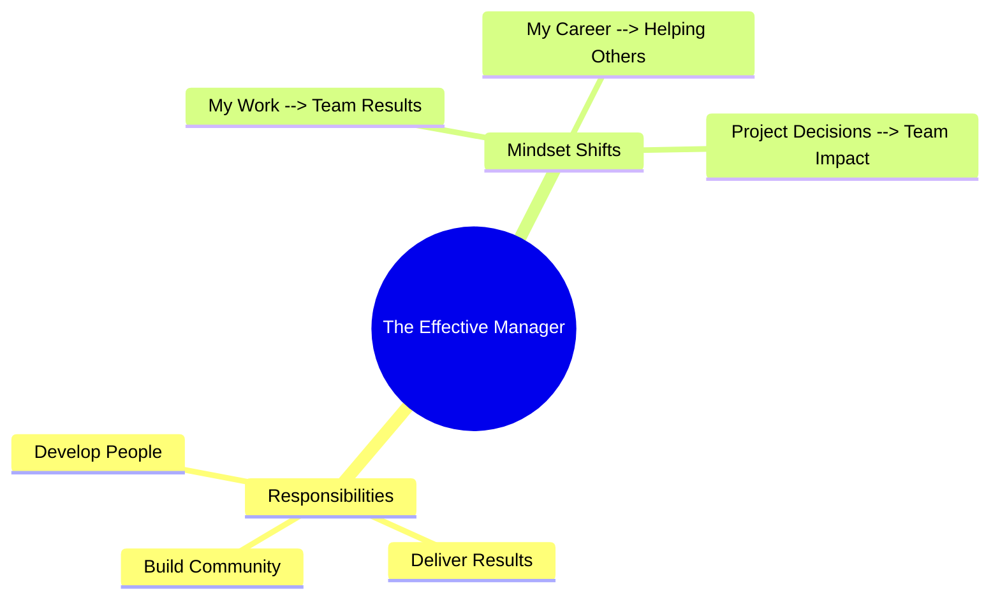
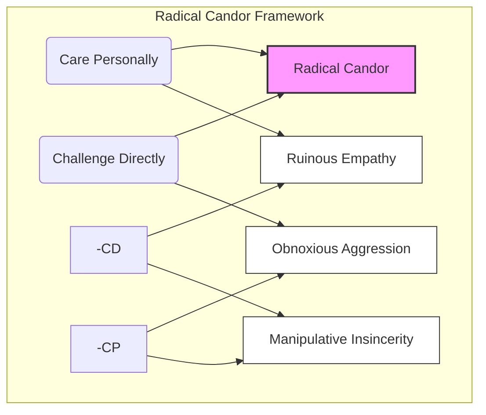
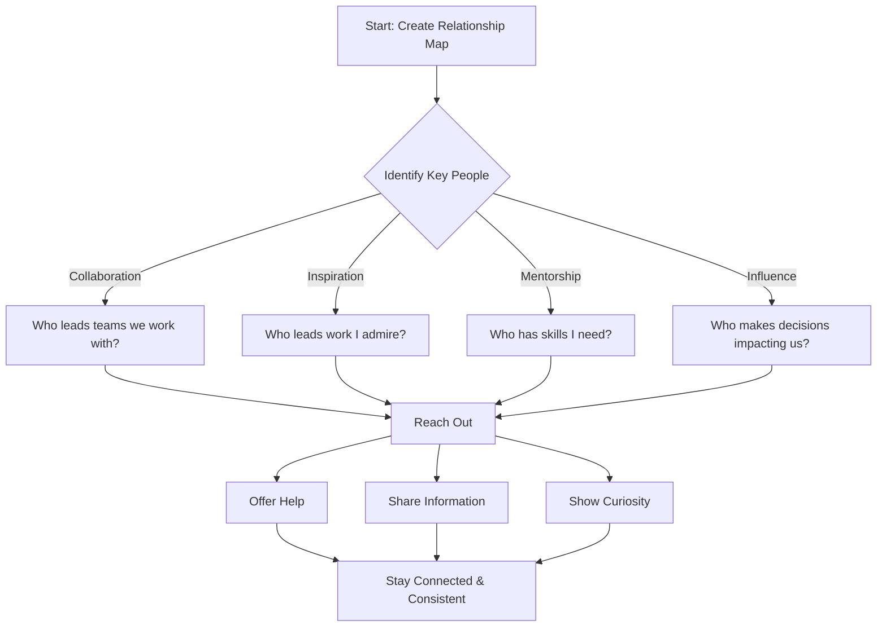
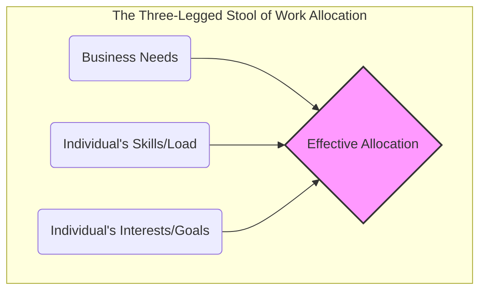
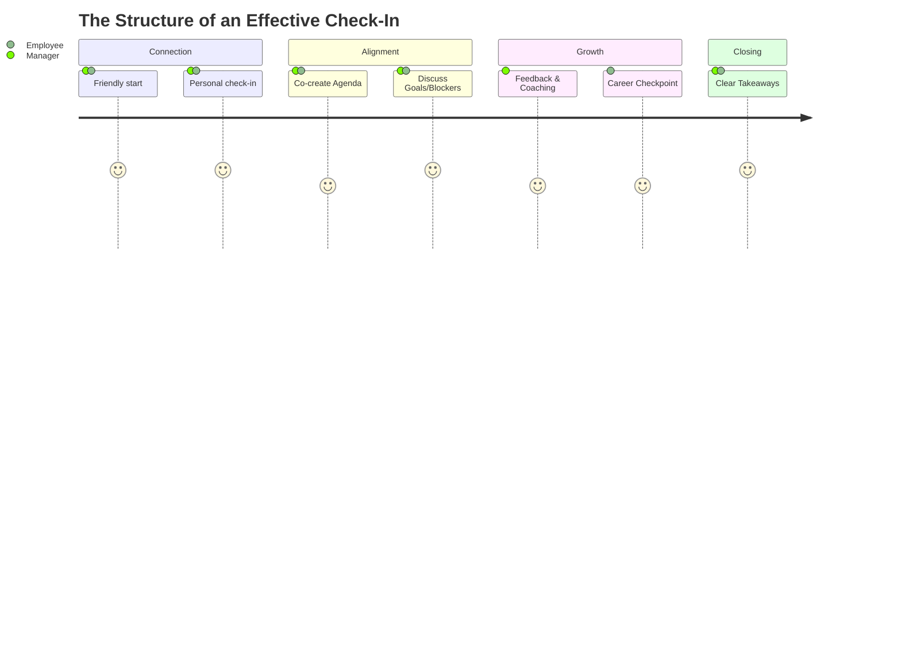

As I transition into a team leader role in the Platform Engineering team at Caspeco, shifting from a pure engineering focus to a broader team leadership and people management perspective is a great priviliege and an opportunity. This post describes the insights from the Google People Management Essentials Specialization.

The material resonated with my experience as a teacher, which is basically team management on steroids. The four courses offer a structured framework for what often feels like intuition.

## Part 1: Creating a High-Performing Team

The first course focuses on the fundamental shift in identity required to lead effectively.

### The Manager's Core Responsibility

The "manager" title isn't just a promotion; it's a career change. It requires a distinct shift in mindset. You are no longer judged solely by your commit history or architectural designs, but by the output and health of your team.

Google defines the manager's responsibilities through three pillars: **Building Community**, **Delivering Results**, and **Developing People**. To achieve this, you must navigate three critical mindset shifts:

**Key Takeaway:** It takes conscious effort to stop hoarding tasks. Ask yourself: _What am I holding onto that could be a growth opportunity for someone else?_

### Culture and Radical Candor

Building an effective team is less about _who_ is on the team and more about _how_ they work together. This requires a culture of learning rather than blame.

One of the most powerful tools for this is [**Radical Candor**](https://www.radicalcandor.com/frequently-asked-questions) (Kim Scott). It's the ability to **Challenge Directly** while **Caring Personally**. In my own experience, addressing difficult behavior decisively—while being honest about the impact and reaffirming respect for the individual—is far more effective than "nice" silence or aggressive criticism.

By shifting 1:1s from status updates to genuine dialogues and reframing failures as quests for learning, we move the team toward the "Radical Candor" quadrant.

### Managing Beyond the Team

One common trap for new managers is focusing exclusively _downward_ on their direct reports. However, effective leadership requires managing **up** (to your leaders) and **across** (to peers and other teams).

The course suggests a proactive approach to networking—not for politics, but for effectiveness. You need to identify who influences your team's success and who you can learn from.

_Certificate for completing the Create a High-Performing Team course_

---

## Part 2: Set and Achieve Team Goals

The second course shifts focus to execution: how to translate vision into reality while keeping the team engaged.

### The Art of Work Allocation

When it comes to execution, assigning tasks isn't just about resource availability; it's about **designing opportunities**.

Effective work allocation is like a three-legged stool. If any leg is missing, the structure falls. You have to balance the business needs with the individual's current capacity _and_ their long-term growth goals.

### Setting Goals with Clarity, Meaning, and Impact

To drive high performance, every team member needs to answer three questions:

1.  **Clarity**: What exactly is expected of me?
2.  **Meaning**: Why does this work matter to me personally?
3.  **Impact**: How does my work move the needle for the organization?

We use **SMART** goals (Specific, Measurable, Attainable, Relevant, Time-bound) to ensure clarity, but the _meaning_ comes from your conversations as a manager.

### The Modern Check-In

Finally, the course emphasizes changing the nature of 1:1 meetings. These shouldn't be just status updates—that's what Jira or stand-ups are for. A 1:1 is a dedicated time to support the human behind the work.

A great check-in follows a structure that prioritizes connection and growth:

**Actionable Tip:** Create a shared document for each team member. Use it to track not just active projects, but long-term career goals and discussion points for upcoming 1:1s. This ensures nothing gets lost in the daily noise.

_Certificate for completing the Set and Achieve Team Goals course_

## Final Thoughts

The transition to management is a journey of letting go of control over _tasks_ to gain influence over _outcomes_. By focusing on building a psychologically safe team, managing your network, and being intentional about goal setting and check-ins, you lay the foundation for a high-performing team that can thrive without your constant intervention.
