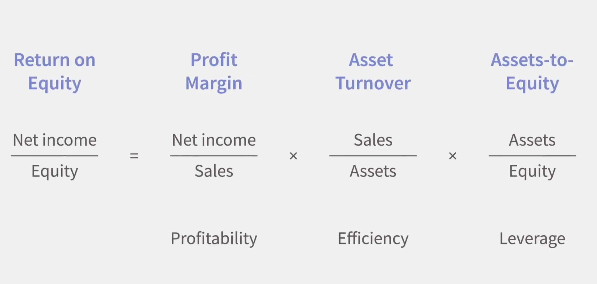
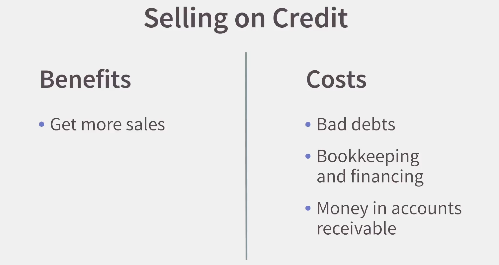
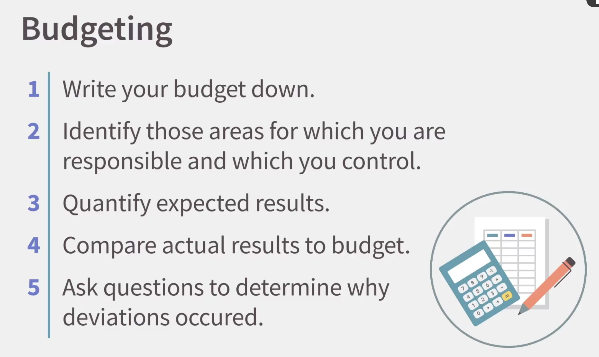

## Finance and Accounting Basics

Finance:

- What things do I need?
- How do I get the money to buy those things?
- How do I manage those things efficiently once I have them?

Three types of players:

- Entrepreneurs
- Investors
- Facilitators (match entrepreneurs with investors):
  - Banks
  - Mutual funds
  - Private equity funds
  - Insurance companies
  - Investment banks

Accounting: A system for providing quantitative information, primarily financial in nature, about economic entities that is intended to be useful in making economic decision.

Accounting types:

- Bookkeeping (the routine gathering and recording of data)
- Financial (reporting to people outside of the organization)
- Managerial (the detailed, secret data that individuals use inside their organizations to make detailed decisions)
- Income taxes (make sure the company is in compliance with income tax law)

## Most Common Financial Reports

Financial statement:

- Balance sheet:
  - A company's assets
    A balance sheet also shows sources to get money:
    - Borrowing
    - Investment
    - Profits
      Equity = direct investment + retained profits
- Income statement: a report telling how much money a company made during a given time period
- Statement of cash flows

### Balance Sheet

Built around the concept of the accounting equation: assets = liabilities + equity
Assets: resources owned or controlled by a company that will provide probable future benefit.
A liability is a financial obligation or debt owed to another party.

### Income Statement

Revenues - Expenses = Net Income

Revenue: the amount of assets created from the sale of goods or services.

### The Statement Of Cash Flows

A report of the amount of cash collected and cash paid by a company during a given time period.

Several types of cash flows:

1. Cash outflows from operating activities:

- Wages
- Utilities
- Taxes
- Interest

2. Cash outflows from investing activities:

- New buildings
- New land
- New machines

3. Financing activities: borrowing money or getting new investments from owners

## Techniques for Using Financial Reports

Financial ratio analysis: the examination of relationships among financial statement numbers.

Two types of financial ratio analysis:

- Compare the same company across time
- Compare across companies at the same point in time

### Return on Equity

Computed by dividing net income by equity.
Measures the amount of profit earned by dollar of owner investment. Based on historical events.

Market return: A combination of dividends received and increases in the market value of the shares.

### The DuPont Framework

The DuPont framework is constructed on the idea that ROE is composed of three distinct components:

- Profitability: how well we control our expenses to squeeze as much profit as possible out of each dollar of sales
- Efficiency: how efficiently we use our assets to generate sales
- Leverage: how much money we have borrowed to leverage the initial equity investment

Careful analysis leads us to conclusions about the operations of the business.

## Short-Term Financial Management

Operating cycle: how long it takes from when a company buys inventory, sells that inventory, and collects the cash from that sale.

The operating cycle should not be too long because that ties up cash. Cash shortfall is inconvenient and can be costly. A business needs to make sure to keep sufficient cash - but how much and how to strike the right balance? There are tools to help us manage our cash, e.g., a cash budget. Experience and knowing your suppliers also helps with managing your cash flow, e.g., delaying payments as a source of short-term financing. Another way to obtain short-term financing is obtaining a bank loan.

Selling on credit is an age-old marketing technique which attracts customers and sales.

The Goldilocks principle: companies try to minimize the amount of money invested in receivables and inventory while at the same time having enough to ensure smooth operation.

## Costing a Product or Service

Variable costs: a cost that changes depending on the number of good produced or services provided, e.g., ingredients, materials, etc.
Fixed costs: a cost that stays the same no matter how many goods or services are provided, e.g., equipment, rent, employees, etc.
Contribution margin: the difference between the selling price and the variable costs.
Overhead costs: business expenses that are not tied directly to generating revenue.

How to calculate your break even point?
Break-Even Point: the point where costs are exactly covered - no gain and no loss. Look at the break-even point BEFORE you decide to go into a business.
Target profit: the profit we want to generate. We treat it as a fixed cost.

## Creating a Budget

Responsibility accounting: individuals are accountable only for those inflows and outflows over which they have control.

A budget is needed so we can reason about the deviations between the budget plan and the actual costs.

## Income Tax Basics

Income taxes are complicated.

Basics:

- Tax brackets: you pay more tax for the part of your income that falls into the higher tax bracket
- Tax deductions and tax credits; tax deductions are expenditures that the government favors that can be used to reduce taxable income, e.g., charitable contributions, investing in IRA or 401(k) plan, home mortgage interest, etc.
