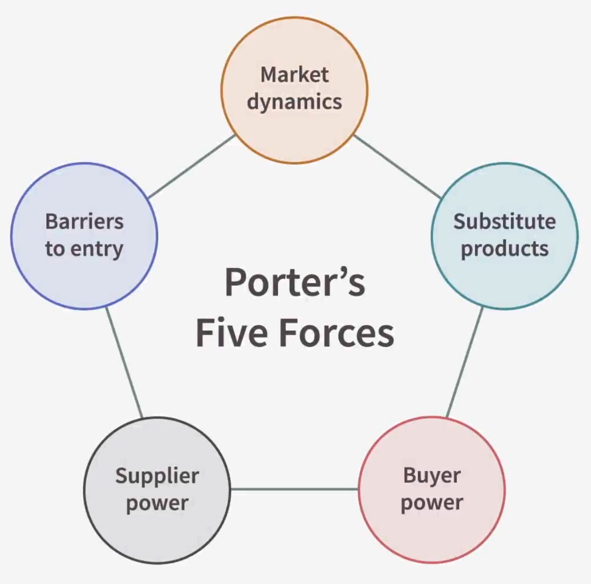

## Developing Business Acumen

### Business Acumen Basics

Business acumen means understanding how a business works, its business model, what makes it profitable, and the organization's strategy and operations. You also have to understand how to market the business, and the people within the business.

### Common Terminology

- Business model: a company's plan to generate revenue and profit
- Value chain: a high-level model showing how business add value to input and sell products
- Strategy: a plan for competing in the market and achieving long-term success
- Porter's Five Forces
  
- Growth horizons:
  - Near-term opportunities
  - Mid-term opportunities
  - Long-term opportunities
- P&L (Profit and Loss Statement): A financial report that tracks revenues and expenses to determine profit or loss
- SG&A (Selling, General, and Administrative Expenses): Expenses to promote, sell, deliver products, and manage the company
- ROI (Return on Investment): Measures the profit made from an investment relative to its cost
- Capital Expenditures (Investments in assets like factories, equipment, or software to generate future value)
- Fixed and Variable Cost

You need to understand the basics of your business to understand how to differentiate it, compete better, and make it successful. Talk to the people in your business to understand it!

### Your Business Model

Customers:

- Individual consumers
- Businesses

It is crucial that you understand your customer:

- Why do the buy from you?
- What problem do you solve?

Explain the problem your business solves, and how your product or service solves it, and how it does it better than the competition.

### Pricing Models

The pricing strategy is one of the most crucial decisions to make, and has a huge impact on overall profitability.

Pricing models:

- Cost-plus: the cost of the service plus the margin
- Value-based: evaluate the value you deliver and take a portion of that

## Your Financials

### Profit&Loss Statement

- Revenues
- Costs of goods sold (COGS): the cost of all the inputs for delivering your product or service
- Gross profit
- Operating expenses
- Operating profit
- Interest
- Taxes
- Depreciation
- Amortization: big expenses that you spread over time
- Net income: the true profit of your business

### Performance Levers

- Costs:
  - Labor
  - Raw materials

- Indirect costs:
  - Advertising
  - Overhead
  - Utilization

Understand what pulling each lever does and how it affects performance.

### Assess Trends

General trends:

- Sales and profit
- Margin
- Cash accrual

Operating trends:

- Head count
- Spending
- Raw materials

Competitive trends:

- Market share
- Utilization
- Fill rate: the percentage of customer orders that a business can fulfill immediately from available stock
- Cost per account

**Measure only the metrics that will lead to change!**

## Your Strategy

Mitigation measures:

- Sufficient cash
- Lines of credit
- Redundant systems
- Redundant locations
- Redundant personnel skills

Contingency plans:

- Write down important activities or cuntion
- List possible major disruptions
- Make a plan for both of the above
