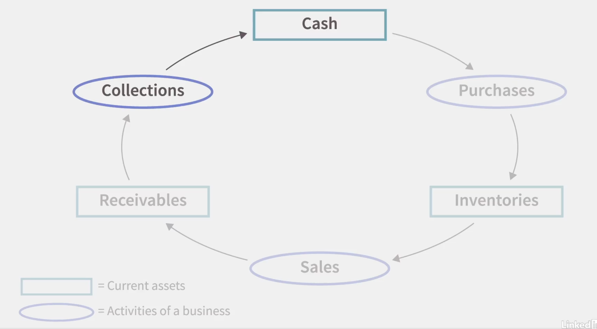

## Short-Term Financial Management

Operating cycle: how long it takes from when a company buys inventory, sells that inventory, and collects the cash from that sale.

The operating cycle should not be too long because that ties up cash. Cash shortfall is inconvenient and can be costly. A business needs to make sure to keep sufficient cash - but how much and how to strike the right balance? There are tools to help us manage our cash, e.g., a cash budget. Experience and knowing your suppliers also helps with managing your cash flow, e.g., delaying payments as a source of short-term financing. Another way to obtain short-term financing is obtaining a bank loan.

Selling on credit is an age-old marketing technique which attracts customers and sales.

The Goldilocks principle: companies try to minimize the amount of money invested in receivables and inventory while at the same time having enough to ensure smooth operation.

## Costing a Product or Service

Variable costs: a cost that changes depending on the number of good produced or services provided, e.g., ingredients, materials, etc.
Fixed costs: a cost that stays the same no matter how many goods or services are provided, e.g., equipment, rent, employees, etc.
Contribution margin: the difference between the selling price and the variable costs.
Overhead costs: business expenses that are not tied directly to generating revenue.

How to calculate your break even point?
Break-Even Point: the point where costs are exactly covered - no gain and no loss. Look at the break-even point BEFORE you decide to go into a business.
Target profit: the profit we want to generate. We treat it as a fixed cost.

## Creating a Budget

Responsibility accounting: individuals are accountable only for those inflows and outflows over which they have control.

A budget is needed so we can reason about the deviations between the budget plan and the actual costs.

## Income Tax Basics

Income taxes are complicated.

Basics:

- Tax brackets: you pay more tax for the part of your income that falls into the higher tax bracket
- Tax deductions and tax credits; tax deductions are expenditures that the government favors that can be used to reduce taxable income, e.g., charitable contributions, investing in IRA or 401(k) plan, home mortgage interest, etc.
