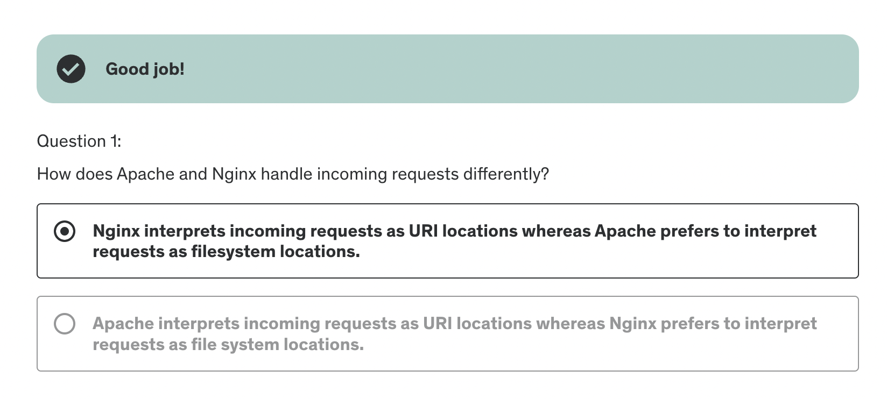
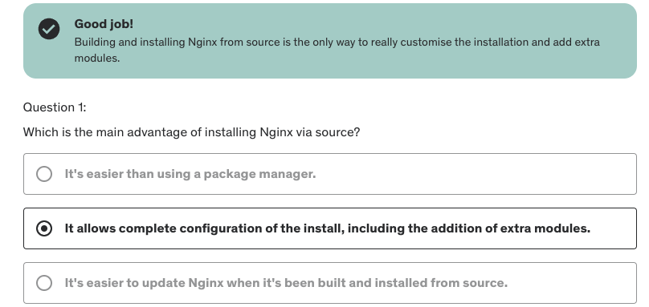

# The course Nginx Fundamentals: High performance servers from scratch

[Nginx](https://github.com/nginx/nginx) is a high-performance, open-source web server and reverse proxy designed for 
speed, scalability, and efficient resource use. Its core functionality includes serving static content, load balancing, 
and acting as a reverse proxy to forward client requests to backend servers. Nginx excels at handling large numbers of 
concurrent connections, making it ideal for high-traffic websites and applications. Additionally, it supports features like 
caching, SSL termination, and URL rewriting, which enhance performance, security, and flexibility in modern web architectures.

[This Udemy course](https://www.udemy.com/course/nginx-fundamentals/) covers the following topics:
  * Learn to customise the NGINX installation
  * Configure NGINX
  * Learn to tweak NGINX for optimal performance 
  * Secure NGINX with some security best practises
  * Learn about NGINX load balancing and reverse proxying

## Overview

### About Nginx

Nginx was built in 2004 by [Igor Sysoev](https://en.wikipedia.org/wiki/Igor_Sysoev) as he was looking for an alternative to Apache, 
and wanted to build a replacement capable of handling [10000 concurrent connections](https://en.wikipedia.org/wiki/C10k_problem),
with a focus on:

  * High performance
  * High concurrency
  * Low memory usage

Today, Nginx serves the majority of the world's websites, not only because of its performance but also because of its relative ease of use.
At its core, Nginx is a reverse proxy server.

### Nginx vs. Apache

There are some key differences between Nginx and Apache:

1. Nginx can serve static resources much faster
2. Nginx can handle a much larger amount of concurrent requests
3. In Nginx requests are interpreted as URI locations first whereas Apache defaults to and favours file-system locations 
   => Nginx can easily function as not only a web server but anything from a load balancer to a mail server

Apache spawns a certain number of processes, each of which can serve a single request at a time. Nginx deals with requests
asynchronously, meaning that a single Nginx process can serve multiple requests concurrently. Because of this, Nginx cannot
embed PHP or other languages directly into the server like Apache can. Instead, all requests for dynamic content are dealt with
by a separate process, such as PHP-FPM, and then reverse proxied back to the client via Nginx.

In terms of performance, Nginx can do the following better than Apache:
1. Serve static content much faster
2. Handle a much larger number of concurrent requests (Apache will accept requests up to the pre-configured limit, then reject the rest)

Nginx and Apache also differ in terms of configuration. Nginx interprets requests as URI locations first, whereas Apache 
defaults to and favours file-system locations. Because of this very design, Nginx can easily function as not only a web server
but anything from a load balancer to a mail server.

### Quiz 1

{: w="700" h="400"}
_Figure 1: Quiz 1_

## Installation

### Server overview

I have set up a [Digital Ocean](https://www.digitalocean.com/) droplet with the following specs:

  * 512 MB RAM
  * 1 vCPU
  * 10 GB SSD
  * Ubuntu 24.04 (LTS) x64

I have also set up SSH key-based authentication by following [this guide on Digital Ocean](https://www.digitalocean.com/community/tutorials/how-to-configure-ssh-key-based-authentication-on-a-linux-server).
To summarize, I followed the following steps:

1. Generate a new SSH key pair with `ssh-keygen`
2. Access the server via the console in the Digital Ocean dashboard
3. Disable password authentication by editing the `/etc/ssh/sshd_config` file and setting `PasswordAuthentication no`
4. Copy the public key to the server manually (copy to the `~/.ssh/authorized_keys` file) 
5. For a smoother login experience, I added an entry in the `~/.ssh/config` file:

    ```bash
    Host digitalocean
        HostName <my-droplet-ip>
        User root
        IdentityFile ~/.ssh/<my-private-key>
    ```

This allows me to log in with `ssh digitalocean`.

### Installing with a package manager

Installing with a package manager is a quick and easy, albeit limited, way to get Nginx up and running.

I followed these steps:

1. Update the package list with `apt-get update`
2. Install with `apt-get install nginx`
3. Run `ps aux | grep nginx` to get the list of nginx processes 
    (the command `ps` lists the processes, `aux` lists all processes (all users + boot processes), and `grep` filters the output):
    ```bash
    root@ubuntu-s-1vcpu-512mb-10gb-ams3-01:~# ps aux | grep nginx
    root       49899  0.0  0.3  11156  1716 ?        Ss   12:50   0:00 nginx: master process /usr/sbin/nginx -g daemon on; master_process on;
    www-data   49900  0.0  0.9  12880  4404 ?        S    12:50   0:00 nginx: worker process
    root       49962  0.0  0.4   7076  2048 pts/0    S+   12:53   0:00 grep --color=auto nginx
    ```
4. Run `ifconfig` to see the network interfaces on your system. Grab the IP address from there and go to it.
   (needed to install the command with `apt-get install net-tools` first, and then the IP address I found under `inet` in the `eth0` section)
5. Open a browser and navigate to the IP address. There I could see the default Nginx page.

The downside of installing with a package manager is that we cannot install any additional modules. 
Therefore, I installed Nginx from source in the next section.

### Building Nginx from source & adding modules

Building Nginx from source allows us to customise the installation and add additional modules. Before starting, I rebuilt 
the droplet to start from scratch. Then I followed these steps:

1. Update the package list with `apt-get update`
2. Download the source code with `wget https://nginx.org/download/nginx-1.27.3.tar.gz`
3. Extract the source code with `tar -zxvf nginx-1.27.3.tar.gz`
4. Try and run `./configure` to see if there are any missing dependencies => get the error: 
    ```bash
    checking for OS
      + Linux 6.8.0-51-generic x86_64
    checking for C compiler ... not found

    ./configure: error: C compiler cc is not found
    ```
5. Install the build-essential package with `apt-get install build-essential`
6. Run `./configure` again => get the error:
    ```bash
    ./configure: error: the HTTP rewrite module requires the PCRE library.
    You can either disable the module by using --without-http_rewrite_module
    option, or install the PCRE library into the system, or build the PCRE library
    statically from the source with nginx by using --with-pcre=<path> option.
    ```
7. Install the PCRE, the zlib and the libssl libraries with `apt-get install libpcre3 libpcre3-dev zlib1g zlib1g-dev libssl-dev`
8. Running ´./configure´now works, but we also want to add custom configuration flags. To see all possible flags, run `./configure --help`
9. Navigate to [Building Nginx from source](https://nginx.org/en/docs/configure.html) to see more information about the available configuration flags
10. Set a few common flags and the http_ssl module with: 
    `./configure --sbin-path=/usr/bin/nginx --conf-path=/etc/nginx/nginx.conf --error-log-path=/var/log/nginx/error.log --http-log-path=/var/log/nginx/access.log --with-pcre --pid-path=/var/run/nginx.pid --with-http_ssl_module`
11. Compile the source code with `make`
12. Install the compiled code with `make install`
13. Check that the configuration files exist with `ls /etc/nginx`
14. Check the Nginx version with `nginx -V`:
    ```bash
    root@ubuntu-s-1vcpu-512mb-10gb-ams3-01:~/nginx-1.27.3# nginx -V
    nginx version: nginx/1.27.3
    built by gcc 13.3.0 (Ubuntu 13.3.0-6ubuntu2~24.04)
    built with OpenSSL 3.0.13 30 Jan 2024
    TLS SNI support enabled
    configure arguments: --sbin-path=/usr/bin/nginx --conf-path=/etc/nginx/nginx.conf --error-log-path=/var/log/nginx/error.log --http-log-path=/var/log/nginx/access.log --with-pcre --pid-path=/var/run/nginx.pid --with-http_ssl_module
    ```
15. Start Nginx with `nginx` and check that process is running with `ps aux | grep nginx`, and also check the default page in the browser

### Adding a Nginx service

The next step is to add a [systemd service](https://systemd.io/) for Nginx. This allows us to start, stop, and restart Nginx with a single command.

I followed these steps:

1. Run `nginx -h` to see the available commands
2. Run `nginx -s stop` to stop the Nginx process
3. Create a new file in `/lib/systemd/system/nginx.service` with the following content:
    ```bash
    [Unit]
    Description=The NGINX HTTP and reverse proxy server
    After=syslog.target network.target remote-fs.target nss-lookup.target

    [Service]
    Type=forking
    PIDFile=/var/run/nginx.pid
    ExecStartPre=/usr/bin/nginx -t
    ExecStart=/usr/bin/nginx
    ExecReload=/bin/kill -s HUP $MAINPID
    ExecStop=/bin/kill -s QUIT $MAINPID
    PrivateTmp=true

    [Install]
    WantedBy=multi-user.target
    ``` 
4. Run `systemctl start nginx` to start Nginx and check that it is running with `systemctl status nginx`
5. Stop Nginx with `systemctl stop nginx` and check that it is stopped with `systemctl status nginx`
6. Enable Nginx to start on boot with `systemctl enable nginx`
7. Reboot the server with `reboot` and check that Nginx is running with `systemctl status nginx`

### Nginx for Windows

Nginx was originally designed for Unix-based systems, but it is also available for Windows. However, the Windows version
has some limitations compared to the Unix version, such as:

  * Poor performance 
  * Single worker process
  * Unsupported modules

I wasn't interested in installing Nginx on Windows, so I skipped this section.

### Quiz 2

{: w="700" h="400"}
_Figure 2: Quiz 2_

## Configuration

### Understanding configuration terms

There are two main configuration terms in Nginx:

1. Context: A block of configuration directives (sections within a configuration) that apply to a specific part of the server. 
   For example, the `http` context contains directives that apply to the entire server, while the `server` context contains 
   directives that apply to a specific server block. Contexts are enclosed in curly braces `{}`, and can be nested within each other.
   Nested contexts inherit directives from their parent contexts. The top-most context is the configuration file itself (the main context),
   which is where we define the global directives that apply to the master process. Other important contexts include `events`, `http`,
   the `server`, and `location` contexts.
2. Directive: specific configuration options that control how Nginx behaves. Directives are placed inside contexts and are
   followed by a value or a block of values. For example, the `server_name` directive specifies the domain name that the server
   block should respond to.

### Creating a virtual host

We will create a virtual host to serve a simple HTML page. To do this, I followed these steps:

1. Asked ChatGTP to create a simple webpage consisting of three files: `index.html`, `style.css`, and `image.png`
2. Went to the root directory with `cd /` (your home directory you can reach with `cd ~` or just `cd`)
3. Created a new directory with `mkdir sites` and then `cd sites` and `mkdir demo`
4. Copied the files `index.html`and `style.css` from ChatGTP to the `demo` directory manually
5. Copied the image `image.png` to the `demo` directory with this command: `scp /Users/aljazkovac/Desktop/courses/nginx-fundamentals/image.png digitalocean:/sites/demo/`
   (the `scp` command copies files between hosts on a network, and the syntax is `scp <source> <destination>`, `digitalocean` is the alias I set up in the `~/.ssh/config` file)
6. Edit the file `/etc/nginx/nginx.conf` and add the following configuration:
    ```bash
      events {
      }

      http {
          server {
            listen 80;
            server_name 206.189.100.37;
            root /sites/demo;
          }
      }
    ```
7. Check the configuration with `nginx -t` and reload the configuration with `systemctl reload nginx`
8. Open a browser and navigate to the IP address. There I could see the simple webpage but without the CSS styling.
9. In the browser's developer tools, I could see that the CSS file was being loaded. However, Nginx was sending the wrong MIME type for the CSS file
   You can check the MIME type with `curl -i http://<IP>/<file>` and see the `Content-Type` header (I got `text/plain` instead of `text/css`)
10. To fix this, one can add a `types` block to the `http` context in the configuration file:
    ```bash
      http {
          types {
              text/css css;
          }
    ```
    However, this is not the best solution because it requires manually adding MIME types for each file type. A better solution 
    is to use the `include` directive to include the `mime.types` file:
    ```bash
      http {
          include mime.types;
    ```
11. Check the configuration with `nginx -t` and reload the configuration with `systemctl reload nginx`
12. Open a browser and navigate to the IP address. There I could see the simple webpage with the CSS styling.
13. Check the stylesheet header with curl to see that the `Content-Type` header is now `text/css`

### Location blocks

Location blocks are used to define how Nginx should handle requests for specific URIs. They are defined within the `server` context

There are different types of location blocks (listed in order of priority):

1. Exact match (= <uri>) : The URI must match the location exactly
2. Preferential prefix match (^~ <uri>) : The URI must start with the specified prefix, and no other location block can match the URI
3. Regular expression match (~ <uri> => case-sensitive) or (~* <uri> => case-insensitive) : The URI must match the specified regular expression
4. Prefix match (<uri>) : The URI must start with the specified prefix

Here is the priority order for location blocks:

Each of the location modifiers below is assigned a priority in the following order:

1. Exact match (=)
2. Preferential prefix match (^~)
3. REGEX match (~*)
4. Prefix match ()

Here are some examples of location blocks:

```bash
events {
}


http {

	include mime.types;

	server {
		listen 80;
		server_name 206.189.100.37;

		root /sites/demo;

		# PREFIX MATCH
		# This matches any location that start with "greet", e.g., greet, greeting, etc.
		location /greet {
			return 200 "Hello from Nginx greet location! => PREFIX MATCH!";

		}

		# PREFIX MATCH
		# This shows that the REGEX match takes priority over this match.
		location /Greet2 {
			return 200 "Hello from Nginx Greet2 location! => PREFIX MATCH PRIORITY PROOF!";

		}

		# PREFERENTIAL PREFIX MATCH
		# The same as a PREFIX MATCH, but takes precedence over REGEX matches.
		location ^~ Greet2 {
			return 200 "Hello from Nginx Greet2 location! => PREFERENTIAL PREFIX MATCH!";

		}

		# EXACT MATCH
		# This matches the exact location.
		location = /greet {
			return 200 "Hello from Nginx greet location => EXACT MATCH!";

		}

		# REGEX MATCH - CASE-SENSITIVE
		# This matches the REGEX expression, but is sensitive to lower vs. uppercase.
		location ~ /greet[0-8] {
			return 200 "Hello from Nginx greet location => REGEX MATCH - CASE SENSITIVE!";

		}

		# REGEX MATCH - CASE-INSENSITIVE
		# This matches the REGEX expression (lower or uppercase).
		location ~* /greet[0-8] {
			return 200 "Hello from Nginx greet location => REGEX MATCH - CASE INSENSITIVE!";

		}

	    }
}
```

### Variables

There are two types of variables in Nginx:

1. Configuration variables (variables we define in the configuration file), e.g., `set $var "value";`
2. [Nginx module variables](https://nginx.org/en/docs/varindex.html) (variables provided by Nginx modules), e.g., `$uri`, `$args`, `$request_uri`

**NOTE** The use of conditionals inside location blocks is [discouraged because it can lead to unexpected behaviour](https://github.com/nginxinc/nginx-wiki/blob/master/source/start/topics/depth/ifisevil.rst).

Here is a simple example of using Nginx built-in variables:

```bash
events {}


http {

        include mime.types;

        server {

                listen 80;
                server_name 206.189.100.37;

                root /sites/demo;

                location /inspect {

                        return 200 "$host\n$uri\n$args";
                }

                location /inspectarg {

                        return 200 "Name: $arg_name";
                }
        }
}
```

Here is an example of using a configuration variable and a conditional in Nginx:

```bash
events {}


http {

        include mime.types;

        server {

                listen 80;
                server_name 206.189.100.37;

                root /sites/demo;

                set $weekend 'No';

                # Check if day is weekend
                if ($date_local ~ 'Saturday|Sunday' ) {
                        set $weekend 'Yes';
                }

                location /isweekend {
                        return 200 $weekend;
                }
        }
}
```

### Rewrites & redirects

There are two rewrite directives in Nginx:

1. The rewrite directive: ```bash rewrite pattern URI;```
    ```bash
    events {}

    http {

            include mime.types;

            server {

                    listen 80;
                    server_name 206.189.100.37;

                    root /sites/demo;

                    # Starting with user and more than one-word character
                    rewrite ^/user/\w+ /greet;

                    location /greet{
                            return 200 "Hello User";
                    }
            }
    }
    ```
   The URI here does not change in the browser, although the request is rewritten to the `/greet` location.
2. The return directive: ```bash return status URI;``` => if the status is a 3xx, the return directive behaviour becomes 
   a redirect, and it accepts a URI as the second argument:
   ```bash
    events {}
    http {

            include mime.types;

            server {

                    listen 80;
                    server_name 206.189.100.37;

                    root /sites/demo;
                    
                    location /logo {
                            return 307 /image.png;
                    }
            }
    }
    ```
    The URI changes in the browser with the redirect, and points to the `/image.png` location.

**NOTE** With the redirect, the URI changes in the browser, while with the rewrite, the URI stays the same.

**PERFORMANCE REWRITES vs. REDIRECTS** The rewrite directive is used to rewrite the URI before it is processed by Nginx. When a URI is rewritten, it gets reevaluated.
The return directive, on the other hand, does not reevaluate the URI but instead sends a redirect to the client.
Therefore, a rewrite directive is more resource-intensive than a return directive.

With rewrites, we can capture parts of the original URI. For example, if we have a URI `/user/john`, 
we can capture the username `john` with a regex pattern and rewrite it to `/greet`:
  
  ```bash
  events {}


http {

        include mime.types;

        server {

                listen 80;
                server_name 206.189.100.37;

                root /sites/demo;

                # Starting with user and more than one-word character
                rewrite ^/user/(\w+) /greet/$1;

                location /greet {

                        return 200 "Hello User";
                }

                location = /greet/john {
                        return 200 "Hello John";
                }
        }
}
```
What happens here is the following:
1. We go to the URI `/user/john`
2. The URI gets rewritten to `/greet/john` and reevaluated
3. The new URI skips the `/greet` location block and goes directly to the `/greet/john` location block because the exact match has priority

**OPTIONAL FLAGS** The rewrite directive can take optional flags, such as `last`, `break`, `redirect`, and `permanent`.
The `last` flag makes sure that the location cannot be rewritten again after the current rewrite and reevaluation. 
In the example below, without the `last` flag, the URI would be reevaluated after the rewrite, and would then be rewritten again to `/image.png`.
With the `last` flag set, the URI is rewritten to `/greet/john`, reevaluated, and is then not rewritten again, which 
means that we get the response "Hello John" instead of the image.
  
```bash
events {}


http {

        include mime.types;

        server {

                listen 80;
                server_name 206.189.100.37;

                root /sites/demo;

                # Starting with user and more than one-word character
                rewrite ^/user/(\w+) /greet/$1 last;
                rewrite ^/greet/john /image.png;

                location /greet {

                        return 200 "Hello User";
                }

                location = /greet/john {
                        return 200 "Hello John";
                }
        }
}
```

### Try files & named locations

### Logging

### Inheritance & directive types

### PHP processing

### Workers processes

### Buffers & timeouts

### Adding dynamic modules

### Quiz 3

## Performance

### Headers & expires

### Compressed responses with gzip

### FastCGI_cache

### HTTP2

### Server push

## Security

### HTTPS(SSL)

### Rate limiting

### Basic authentication

### Hardening Nginx

### Quiz 4

### Let's Encrypt - SSL certificates

## Reverse proxy & load balancing

### Prerequisites

### Reverse proxy

### Load balancer

### Load balancer options

### Documentations & resources

## Outro

### Bonus lecture: feedback & Stackacademy.tv courses

## Archive

### Adding an Nginx Init service

### GeoIP

### Video streaming
